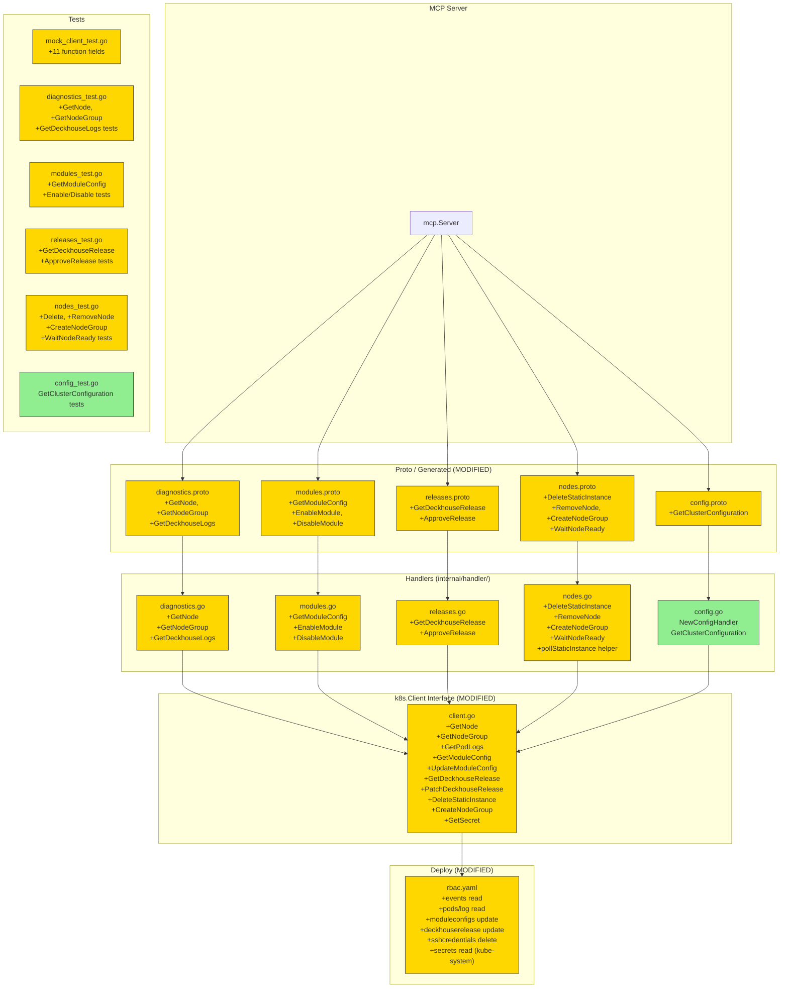

# Design: P1 Core Operations

**Feature**: p1-core-operations  
**Phase**: [3/6] Design  
**Handlers**: 13 new MCP tools (P1 priority)

---

## §2.1 Overview

P1 Core Operations adds 13 handlers across 5 API blocks (A, B, C, D, E), extending the proto services, k8s.Client interface, and handler implementations. All P1 handlers follow the established patterns from P0.

### Handler Groups (by complexity)

| Group | Handlers | Pattern |
|-------|----------|---------|
| G1: Read single resource | A3 GetNode, A6 GetNodeGroup, B2 GetModuleConfig, C2 GetDeckhouseRelease | Get by name → map to proto response |
| G2: Read logs | A11 GetDeckhouseLogs | ListPods → get logs → filter |
| G3: Simple writes | B3 EnableModule, B4 DisableModule, C3 ApproveRelease, D5 DeleteStaticInstance, D10 CreateNodeGroup | Get → patch/update/delete |
| G4: Composite + polling | D6 RemoveNode, D12 WaitNodeReady | Multi-step with GetStaticInstance polling |
| G5: External secret read | E1 GetClusterConfiguration | Get Secret from kube-system |

Total new k8s.Client methods: 11  
Total modified proto files: 5 (`diagnostics`, `modules`, `releases`, `nodes`, `config`)  
New Go files: `internal/handler/config.go`, test files

---

## §2.2 Architecture



---

## §2.3 Components

### Files Requiring Changes

| File | Change Type | Description |
|------|-------------|-------------|
| `proto/deckhouse/v1/diagnostics.proto` | MODIFIED | +3 RPCs: GetNode, GetNodeGroup, GetDeckhouseLogs |
| `proto/deckhouse/v1/modules.proto` | MODIFIED | +3 RPCs: GetModuleConfig, EnableModule, DisableModule |
| `proto/deckhouse/v1/releases.proto` | MODIFIED | +2 RPCs: GetDeckhouseRelease, ApproveRelease |
| `proto/deckhouse/v1/nodes.proto` | MODIFIED | +4 RPCs: DeleteStaticInstance, RemoveNode, CreateNodeGroup, WaitNodeReady |
| `proto/deckhouse/v1/config.proto` | MODIFIED | +1 RPC: GetClusterConfiguration (first real RPC in ConfigAPI) |
| `proto/deckhouse/v1/diagnostics.pb.go` | GENERATED | regenerated after proto change |
| `proto/deckhouse/v1/diagnostics.mcp.go` | GENERATED | regenerated after proto change |
| `proto/deckhouse/v1/modules.pb.go` | GENERATED | regenerated |
| `proto/deckhouse/v1/modules.mcp.go` | GENERATED | regenerated |
| `proto/deckhouse/v1/releases.pb.go` | GENERATED | regenerated |
| `proto/deckhouse/v1/releases.mcp.go` | GENERATED | regenerated |
| `proto/deckhouse/v1/nodes.pb.go` | GENERATED | regenerated |
| `proto/deckhouse/v1/nodes.mcp.go` | GENERATED | regenerated |
| `proto/deckhouse/v1/config.pb.go` | GENERATED | regenerated |
| `proto/deckhouse/v1/config.mcp.go` | NEW (generated) | new file, config.mcp.go did not exist |
| `internal/k8s/client.go` | MODIFIED | +11 methods to Client interface + implementations |
| `internal/handler/diagnostics.go` | MODIFIED | implement GetNode, GetNodeGroup, GetDeckhouseLogs |
| `internal/handler/modules.go` | MODIFIED | implement GetModuleConfig, EnableModule, DisableModule |
| `internal/handler/releases.go` | MODIFIED | implement GetDeckhouseRelease, ApproveRelease |
| `internal/handler/nodes.go` | MODIFIED | implement DeleteStaticInstance, RemoveNode, CreateNodeGroup, WaitNodeReady; extract pollStaticInstance helper |
| `internal/handler/config.go` | NEW | ConfigHandler struct + GetClusterConfiguration |
| `internal/handler/mock_client_test.go` | MODIFIED | +11 function fields |
| `internal/handler/diagnostics_test.go` | MODIFIED | +tests for new methods |
| `internal/handler/modules_test.go` | MODIFIED | +tests for new methods |
| `internal/handler/releases_test.go` | MODIFIED | +tests for new methods |
| `internal/handler/nodes_test.go` | MODIFIED | +tests for new methods |
| `internal/handler/config_test.go` | NEW | tests for ConfigHandler |
| `deploy/rbac.yaml` | MODIFIED | add P1 RBAC permissions |
| `cmd/deckhouse-mcp/main.go` | MODIFIED | register ConfigAPIToolHandler |

### Files NOT Changing

| File | Reason |
|------|--------|
| `Dockerfile` | No new build steps |
| `go.mod` / `go.sum` | No new dependencies |
| `easyp.yaml` | No new plugins or proto deps |
| `deploy/deployment.yaml` | No new env vars or mounts |
| `deploy/service.yaml` | No port changes |
| `cmd/deckhouse-mcp/main.go` — SSE setup | Only ConfigHandler registration added |

---

## §2.4 Architectural Decision Records

### ADR-1: Extract `pollStaticInstance` helper from AddWorkerNode

**Context**: `AddWorkerNode` contains inline polling logic (30s interval, deadline loop). `WaitNodeReady` (D12) needs identical logic.

**Decision**: Extract unexported `func (h *NodesHandler) pollStaticInstance(ctx context.Context, name string, timeout time.Duration) (phase string, elapsed string, timedOut bool, err error)` from `AddWorkerNode`. Both `AddWorkerNode` and `WaitNodeReady` call it.

**Consequences**: One polling implementation. Tests for `WaitNodeReady` reuse the mock pattern from `AddWorkerNode` tests. `AddWorkerNode` behavior unchanged.

**Rejected**: Keeping inline in both — duplication; moving to `k8s/` package — wrong layer (polling is business logic).

---

### ADR-2: RemoveNode (D6) — find StaticInstance by node name

**Context**: `RemoveNode` receives a Node name. StaticInstance name may or may not match. Need to link them.

**Decision**: 
1. Get `corev1.Node` by name via `GetNode`.
2. Look up `StaticInstance` with matching name (StaticInstance name == Node name in Deckhouse convention).
3. If no StaticInstance found → return error `"static instance for node %q not found"`.
4. Cordon the node (update `spec.unschedulable = true`).
5. Delete all non-DaemonSet pods via `DeleteCollection` (Eviction is P2).
6. Delete StaticInstance (triggers Deckhouse cleanup).
7. Return `{drained: true, deleted: true}`.

**Consequences**: Simple implementation. No PDB awareness (P2). Static-nodes only (CE scope).

**Rejected**: Searching by label — unreliable; skipping cordon — unsafe.

---

### ADR-3: EnableModule / DisableModule — full Update (not patch)

**Context**: ModuleConfig has `spec.enabled` and optional `spec.settings`. Need to flip `enabled` without losing `settings`.

**Decision**: 
1. `GetModuleConfig` to read current state.
2. Set `spec.enabled = true/false` in the unstructured object preserving all other fields.
3. `UpdateModuleConfig` (full PUT).
4. Return `{success: true, previousState: <old_enabled>}`.

**Consequences**: Optimistic update — no conflict detection. Acceptable for a CLI-like tool; conflicts rare in manual ops.

**Rejected**: Patch — more complex with unstructured; JSON merge patch loses field semantics.

---

### ADR-4: ApproveRelease — patch annotation, not full Update

**Context**: `DeckhouseRelease` is immutable spec. Approval is done via annotation `release.deckhouse.io/approved: "true"`.

**Decision**: Use `PatchDeckhouseRelease` (strategic merge patch on `metadata.annotations`). This is minimal — only touches annotations, avoids resourceVersion conflicts on spec.

**Consequences**: Clean atomic patch. `PatchDeckhouseRelease` added to Client interface with `types.MergePatchType`.

**Rejected**: Full Update — risk of conflict if anything else updated release concurrently.

---

### ADR-5: GetClusterConfiguration — Secret in kube-system

**Context**: ClusterConfiguration stored as Secret `d8-cluster-configuration` in namespace `kube-system`, key `cluster-configuration.yaml`.

**Decision**: 
1. Add `GetSecret(ctx, namespace, name string) (*corev1.Secret, error)` to Client interface.
2. Handler reads secret, returns `string(data["cluster-configuration.yaml"])` as-is — no masking needed (confirmed in Explore: no passwords in this config).
3. Handler registered via generated `ConfigAPIToolHandler`.

**Consequences**: New RBAC permission: `secrets` `get` in `kube-system`. Scoped ClusterRole or namespace-specific RoleBinding required (see §RBAC below).

**Rejected**: Reading from ConfigMap — wrong location; decoding/parsing the YAML — unnecessary complexity for an informational tool.

---

### ADR-6: GetDeckhouseLogs — pods/log in d8-system

**Context**: Deckhouse controller pod runs in `d8-system`. Need to list pods, find the `deckhouse` pod, get logs.

**Decision**:
1. `ListPods(ctx, "d8-system")` — existing method.
2. Find pod with label `app=deckhouse`.
3. `GetPodLogs(ctx, namespace, podName, tail, since)` — new client method using typed client's `CoreV1().Pods().GetLogs()`.
4. Apply `grep` filter client-side (substring match) if `req.Grep != nil`.
5. Return `{logs: string}`.

**Consequences**: Requires `pods/log` RBAC in `d8-system`. If no deckhouse pod found → error.

**Rejected**: Querying logs API directly with label selector — not supported by core/v1 Pods log API.

---

## §2.5 Data Models

### New proto messages (key additions)

```protobuf
// diagnostics.proto additions
message GetNodeRequest { string name = 1; }
message GetNodeResponse {
  NodeInfo node = 1;
  repeated NodeCondition conditions = 2;
  map<string, string> allocatable = 3;
  map<string, string> capacity = 4;
  optional string static_instance_phase = 5;
  repeated NodeEvent events = 6;
}
message NodeCondition { string type = 1; string status = 2; string message = 3; }
message NodeEvent { string reason = 1; string message = 2; string type = 3; google.protobuf.Timestamp last_time = 4; int32 count = 5; }

message GetNodeGroupRequest { string name = 1; }
message GetNodeGroupResponse {
  string name = 1;
  string node_type = 2;
  int32 ready = 3;
  int32 total = 4;
  int32 up_to_date = 5;
  map<string, string> spec = 6; // raw spec fields as JSON-encoded strings (or use google.protobuf.Struct)
  repeated string node_names = 7;
}

message GetDeckhouseLogsRequest {
  optional int32 tail = 1;
  optional string since = 2;
  optional string grep = 3;
}
message GetDeckhouseLogsResponse { string logs = 1; }

// modules.proto additions
message GetModuleConfigRequest { string name = 1; }
message GetModuleConfigResponse {
  string name = 1;
  bool enabled = 2;
  optional int32 version = 3;
  google.protobuf.Struct settings = 4;
  string status_message = 5;
}

message EnableModuleRequest { string name = 1; }
message EnableModuleResponse { bool success = 1; bool previous_state = 2; }

message DisableModuleRequest { string name = 1; }
message DisableModuleResponse { bool success = 1; bool previous_state = 2; }

// releases.proto additions
message GetDeckhouseReleaseRequest { string version = 1; }
message GetDeckhouseReleaseResponse {
  string name = 1;
  DeckhouseReleasePhase phase = 2;
  string version = 3;
  string transition_time = 4;
  bool approved = 5;
  string changelog_link = 6;
  map<string, string> requirements = 7;
}

message ApproveReleaseRequest { string version = 1; }
message ApproveReleaseResponse { bool success = 1; bool previous_approved = 2; }

// nodes.proto additions
message DeleteStaticInstanceRequest { string name = 1; }
message DeleteStaticInstanceResponse { bool success = 1; }

message RemoveNodeRequest {
  string name = 1;
  optional bool drain = 2;         // default: true
}
message RemoveNodeResponse { bool drained = 1; bool deleted = 2; }

message CreateNodeGroupRequest {
  string name = 1;
  string node_type = 2;
  optional int32 count = 3;
  map<string, string> labels = 4;
  optional string disruptions = 5; // "Automatic" | "Manual"
  optional int32 max_pods_per_node = 6;
}
message CreateNodeGroupResponse {
  string name = 1;
  string node_type = 2;
  optional int32 count = 3;
}

message WaitNodeReadyRequest {
  string name = 1;
  optional int32 timeout_seconds = 2;
  optional int32 interval_seconds = 3;
}
message WaitNodeReadyResponse {
  string phase = 1;
  string elapsed = 2;
  bool timed_out = 3;
}

// config.proto additions
message GetClusterConfigurationRequest {}
message GetClusterConfigurationResponse { string configuration = 1; }
```

### New k8s.Client interface methods

```go
// Core (typed)
GetNode(ctx context.Context, name string) (*corev1.Node, error)
CordonNode(ctx context.Context, name string) error
GetPodLogs(ctx context.Context, namespace, pod string, tail *int64, since *string) (string, error)
GetSecret(ctx context.Context, namespace, name string) (*corev1.Secret, error)

// CRDs (dynamic)
GetNodeGroup(ctx context.Context, name string) (*unstructured.Unstructured, error)
CreateNodeGroup(ctx context.Context, obj *unstructured.Unstructured) (*unstructured.Unstructured, error)
GetModuleConfig(ctx context.Context, name string) (*unstructured.Unstructured, error)
UpdateModuleConfig(ctx context.Context, obj *unstructured.Unstructured) (*unstructured.Unstructured, error)
GetDeckhouseRelease(ctx context.Context, name string) (*unstructured.Unstructured, error)
PatchDeckhouseRelease(ctx context.Context, name string, patch []byte) (*unstructured.Unstructured, error)
DeleteStaticInstance(ctx context.Context, name string) error
```

Total: 11 new methods (4 typed + 7 dynamic).

---

## §2.6 Correctness Properties

### Safety (must never happen)

1. **No partial state on D6 failure**: If `GetNode` fails, `RemoveNode` returns error before any mutation.
2. **No EnableModule without reading current state**: `EnableModule` must always read first to return correct `previousState`.
3. **No masking of ClusterConfiguration**: The config YAML is returned verbatim (confirmed no secrets within).
4. **No polling without StaticInstance existence check**: `WaitNodeReady` returns error if `GetStaticInstance` fails on first call.

### Liveness (must eventually happen)

5. **Polling terminates**: Both `WaitNodeReady` and `AddWorkerNode` (via shared helper) always terminate — either by phase==`Running`/`Bootstrapped`, deadline exceeded, or `ctx.Done()`.
6. **Timeout reported**: When polling times out, response always includes `timedOut: true` with last known phase.

### Idempotency

7. **ApproveRelease is idempotent**: Patching annotation when already `"true"` is a no-op; `previousApproved: true` is returned.
8. **EnableModule already enabled**: Returns `success: true, previousState: true` without error.
9. **DeleteStaticInstance not found**: Returns not-found error (not silent success) — explicit failure prevents hidden state.

### Isolation

10. **GetDeckhouseLogs does not affect cluster state**: Read-only; only reads pod logs.
11. **GetClusterConfiguration does not mutate Secret**: Read-only; `GetSecret` performs GET only.

---

## §2.7 Error Handling

All errors follow the existing pattern: `fmt.Errorf("operation: %w", err)`.

| Scenario | Handler Behavior |
|----------|-----------------|
| Resource not found (Get/Delete) | Return error with resource name: `"node group %q not found"` |
| ModuleConfig not found for Enable/Disable | Return `"module config %q not found: %w"` |
| DeckhouseRelease not found for Approve | Return `"release %q not found: %w"` |
| RemoveNode: no StaticInstance | Return `"static instance for node %q not found"` |
| WaitNodeReady: StaticInstance poll error | Return `"polling StaticInstance %s: %w"` |
| WaitNodeReady: timeout | Return successful response with `timedOut: true` + last known `phase` |
| GetDeckhouseLogs: no deckhouse pod | Return `"deckhouse pod not found in d8-system"` |
| GetClusterConfiguration: secret not found | Return `"cluster configuration secret not found: %w"` |
| GetPodLogs: logs API error | Return `"getting pod logs for %s/%s: %w"` |

Composite handler `RemoveNode` failure modes:
- Fail at cordon → return error, no StaticInstance deleted
- Fail at pod eviction → return error, node still cordoned (document in ERRORS.md)
- Fail at DeleteStaticInstance → return `{drained: true, deleted: false}` + error

---

## §2.8 Testing Strategy

**Test Style Source**: Tier 2 — reference files `internal/handler/diagnostics_test.go`, `internal/handler/nodes_test.go`.

**Mock pattern**: Function fields on `mockClient` struct (no external libraries). Each test case sets only the fields needed.

**Test coverage per handler**:

| Handler | Min Test Cases |
|---------|---------------|
| GetNode | found, not found, filter by allocated resources |
| GetNodeGroup | found, not found |
| GetDeckhouseLogs | success with logs, no deckhouse pod, grep filter |
| GetModuleConfig | found with settings, not found |
| EnableModule | already enabled, was disabled |
| DisableModule | already disabled, was enabled |
| GetDeckhouseRelease | found+approved, found+pending, not found |
| ApproveRelease | success, already approved, not found |
| DeleteStaticInstance | success, not found |
| RemoveNode | success full flow, no StaticInstance error |
| CreateNodeGroup | success, already exists |
| WaitNodeReady | reaches Running, times out |
| GetClusterConfiguration | success, secret not found |

**Polling tests** (`WaitNodeReady`, `RemoveNode`): follow `AddWorkerNode` pattern — mock returns `Running` after N calls. Tests are fast (mock doesn't sleep).

**pollStaticInstance helper**: tested indirectly through `WaitNodeReady` and `AddWorkerNode`.

### Project Commands

| Action | Command |
|--------|---------|
| Generate | `task generate` |
| Lint | `task lint` |
| Build | `task build` |
| Test | `task test` |
| Docker | `task docker:build` |

---

## §2.9 RBAC Changes (`deploy/rbac.yaml`)

P1 requires the following additional ClusterRole permissions:

```yaml
# Read node events and pod logs (d8-system)
- apiGroups: [""]
  resources: ["events"]
  verbs: ["get", "list", "watch"]
- apiGroups: [""]
  resources: ["pods/log"]
  verbs: ["get"]

# Cordon nodes (update node spec)
- apiGroups: [""]
  resources: ["nodes"]
  verbs: ["get", "list", "watch", "update", "patch"]

# ModuleConfig: update for enable/disable
- apiGroups: ["deckhouse.io"]
  resources: ["moduleconfigs"]
  verbs: ["get", "list", "watch", "create", "update", "patch"]

# DeckhouseRelease: patch for approve
- apiGroups: ["deckhouse.io"]
  resources: ["deckhouserelease"]
  verbs: ["get", "list", "watch", "update", "patch"]

# StaticInstance: delete
- apiGroups: ["deckhouse.io"]
  resources: ["staticinstances"]
  verbs: ["get", "list", "watch", "create", "update", "patch", "delete"]

# NodeGroup: create
- apiGroups: ["deckhouse.io"]
  resources: ["nodegroups"]
  verbs: ["get", "list", "watch", "create"]
```

**Secret read** (ClusterConfiguration) requires a separate RoleBinding scoped to `kube-system`:

```yaml
# Separate RoleBinding for kube-system secrets (E1)
- apiGroups: [""]
  resources: ["secrets"]
  verbs: ["get"]
  resourceNames: ["d8-cluster-configuration"]
```

This RoleBinding binds the same ServiceAccount `deckhouse-mcp` in namespace `kube-system`.

---

## §2.10 MCP Annotations & Tool Schema

This section specifies the `mcp.options.v1` annotations for every new proto RPC using the `protoc-gen-mcp` skill conventions. All new services use `namespace: "deckhouse"` — tools are named `deckhouse_{MethodName}`.

### Requiredness Policy (proto3 → JSON Schema)

| Proto Pattern | JSON Schema required? |
|---|---|
| `string name = 1` (singular, no `optional`) | **YES** |
| `optional string name = 1` | NO |
| `repeated ...` | NO |
| `map<...>` | NO |

Apply this to all new messages: required parameters are singular non-optional fields; optional filters/defaults use `optional`.

### New RPCs & Required Annotations

#### DiagnosticsAPI additions (`diagnostics.proto`)

```proto
// GetNode — read-only, by name (required)
rpc GetNode(GetNodeRequest) returns (GetNodeResponse) {
  option (mcp.options.v1.method) = {
    title: "Get node"
    description: "Detailed information for a single cluster node: conditions, allocatable/capacity resources, optional StaticInstance phase, and the last 10 events."
    annotations: { read_only_hint: true }
  };
}
// GetNodeRequest.name — required, no `optional`
string name = 1 [(mcp.options.v1.field) = {
  description: "Name of the Node object."
  examples: [{ string_value: "worker-01" }]
  min_length: 1
}];

// GetNodeGroup — read-only
rpc GetNodeGroup(GetNodeGroupRequest) returns (GetNodeGroupResponse) {
  option (mcp.options.v1.method) = {
    title: "Get node group"
    description: "Full spec and status of a NodeGroup plus the list of node names that belong to it."
    annotations: { read_only_hint: true }
  };
}

// GetDeckhouseLogs — read-only, all params optional
rpc GetDeckhouseLogs(GetDeckhouseLogsRequest) returns (GetDeckhouseLogsResponse) {
  option (mcp.options.v1.method) = {
    title: "Get Deckhouse logs"
    description: "Fetch logs of the Deckhouse controller pod running in d8-system. Supports tail line count, time window (e.g. '30m'), and client-side substring grep."
    annotations: { read_only_hint: true }
  };
}
// optional int32 tail — default 100
optional int32 tail = 1 [(mcp.options.v1.field) = {
  description: "Number of log lines to return (from the end)."
  default_value: { integer_value: 100 }
  minimum: 1
  maximum: 10000
}];
// optional string since — free-form duration
optional string since = 2 [(mcp.options.v1.field) = {
  description: "Return logs since this duration ago (e.g. '30m', '2h')."
  examples: [{ string_value: "30m" }, { string_value: "1h" }]
}];
// optional string grep — substring filter
optional string grep = 3 [(mcp.options.v1.field) = {
  description: "Filter log lines to those containing this substring."
}];
```

#### ModulesAPI additions (`modules.proto`)

```proto
// GetModuleConfig — read-only
rpc GetModuleConfig(GetModuleConfigRequest) returns (GetModuleConfigResponse) {
  option (mcp.options.v1.method) = {
    title: "Get module config"
    description: "Full spec and status of a single ModuleConfig including enabled state, settings (as a JSON object), and status conditions."
    annotations: { read_only_hint: true }
  };
}

// EnableModule — write, idempotent
rpc EnableModule(EnableModuleRequest) returns (EnableModuleResponse) {
  option (mcp.options.v1.method) = {
    title: "Enable module"
    description: "Enable a Deckhouse module by setting spec.enabled=true in its ModuleConfig. Returns the previous state."
    annotations: { read_only_hint: false, idempotent_hint: true }
  };
}

// DisableModule — write, idempotent
rpc DisableModule(DisableModuleRequest) returns (DisableModuleResponse) {
  option (mcp.options.v1.method) = {
    title: "Disable module"
    description: "Disable a Deckhouse module by setting spec.enabled=false in its ModuleConfig. Returns the previous state."
    annotations: { read_only_hint: false, idempotent_hint: true }
  };
}
```

#### ReleasesAPI additions (`releases.proto`)

```proto
// GetDeckhouseRelease — read-only
rpc GetDeckhouseRelease(GetDeckhouseReleaseRequest) returns (GetDeckhouseReleaseResponse) {
  option (mcp.options.v1.method) = {
    title: "Get Deckhouse release"
    description: "Full spec and status of a single DeckhouseRelease by version string (e.g. 'v1.74.0')."
    annotations: { read_only_hint: true }
  };
}
// version field — required
string version = 1 [(mcp.options.v1.field) = {
  description: "Release version string, e.g. 'v1.74.0'."
  examples: [{ string_value: "v1.74.0" }]
  pattern: "^v\\d+\\.\\d+\\.\\d+$"
  min_length: 6
}];

// ApproveRelease — write, destructive (triggers cluster update)
rpc ApproveRelease(ApproveReleaseRequest) returns (ApproveReleaseResponse) {
  option (mcp.options.v1.method) = {
    title: "Approve release"
    description: "Approve a pending Deckhouse release for manual update mode by patching the release.deckhouse.io/approved annotation."
    annotations: { destructive_hint: true }
  };
}
```

#### NodesAPI additions (`nodes.proto`)

```proto
// DeleteStaticInstance — write, destructive
rpc DeleteStaticInstance(DeleteStaticInstanceRequest) returns (DeleteStaticInstanceResponse) {
  option (mcp.options.v1.method) = {
    title: "Delete static instance"
    description: "Delete a StaticInstance resource. Deckhouse will gracefully clean up the node."
    annotations: { destructive_hint: true }
  };
}

// RemoveNode — write, destructive (composite)
rpc RemoveNode(RemoveNodeRequest) returns (RemoveNodeResponse) {
  option (mcp.options.v1.method) = {
    title: "Remove node"
    description: "Composite: cordon the node, evict all non-DaemonSet pods, then delete the associated StaticInstance. Fails if no StaticInstance is found for the node (static nodes only)."
    annotations: { destructive_hint: true }
  };
}
// optional bool drain — default true
optional bool drain = 2 [(mcp.options.v1.field) = {
  description: "Whether to cordon and evict pods before deleting the StaticInstance."
  default_value: { bool_value: true }
}];

// CreateNodeGroup — write
rpc CreateNodeGroup(CreateNodeGroupRequest) returns (CreateNodeGroupResponse) {
  option (mcp.options.v1.method) = {
    title: "Create node group"
    description: "Create a new NodeGroup resource. In Deckhouse CE only 'Static' nodeType is supported."
    annotations: { read_only_hint: false }
  };
}
// node_type — required, enum-like string
string node_type = 2 [(mcp.options.v1.field) = {
  description: "Node type: 'Static' (CE), 'CloudEphemeral', 'CloudPermanent', or 'CloudStatic'."
  examples: [{ string_value: "Static" }]
}];

// WaitNodeReady — read-only (polling, no mutation)
rpc WaitNodeReady(WaitNodeReadyRequest) returns (WaitNodeReadyResponse) {
  option (mcp.options.v1.method) = {
    title: "Wait node ready"
    description: "Poll StaticInstance.status.currentStatus.phase until it reaches 'Running' or timeout. Returns the final phase, elapsed time, and whether timeout occurred."
    annotations: { read_only_hint: true }
  };
}
// optional int32 timeout_seconds — default 900
optional int32 timeout_seconds = 2 [(mcp.options.v1.field) = {
  description: "Maximum wait time in seconds."
  default_value: { integer_value: 900 }
  minimum: 30
  maximum: 3600
}];
// optional int32 interval_seconds — default 30
optional int32 interval_seconds = 3 [(mcp.options.v1.field) = {
  description: "Polling interval in seconds."
  default_value: { integer_value: 30 }
  minimum: 5
  maximum: 300
}];
```

#### ConfigAPI first RPC (`config.proto`)

ConfigAPI is currently a stub service with no RPCs and no generated `config.mcp.go`. Adding the first RPC causes `protoc-gen-mcp` to generate `config.mcp.go` for the first time, and `RegisterConfigAPITools()` must be called in `main.go`.

```proto
service ConfigAPI {
  option (mcp.options.v1.service) = {
    namespace: "deckhouse"
    description: "Cluster configuration access."
  };

  // GetClusterConfiguration reads the current ClusterConfiguration.
  rpc GetClusterConfiguration(GetClusterConfigurationRequest) returns (GetClusterConfigurationResponse) {
    option (mcp.options.v1.method) = {
      title: "Get cluster configuration"
      description: "Read the full ClusterConfiguration from the d8-cluster-configuration Secret in kube-system. Returns the raw YAML string."
      annotations: { read_only_hint: true }
    };
  }
}
// GetClusterConfigurationRequest — empty (google.protobuf.Empty not needed; empty message is idiomatic for stub-readiness)
// GetClusterConfigurationResponse.configuration — required string
string configuration = 1 [(mcp.options.v1.field) = {
  description: "ClusterConfiguration YAML content."
}];
```

### `main.go` Registration Change

Adding ConfigAPI's first RPC means `config.mcp.go` is generated with `RegisterConfigAPITools()`. This requires a `ConfigHandler` and a registration call in `main.go`:

```go
// In cmd/deckhouse-mcp/main.go — add alongside existing registrations:
configHandler := handler.NewConfigHandler(k8sClient)
if err := pb.RegisterConfigAPITools(server, configHandler); err != nil {
    log.Fatal(err)
}
```

### ProtoJSON Wire Format Notes

These apply to LLM ↔ MCP tool interactions for the new handlers:

| Field type | JSON representation |
|---|---|
| `google.protobuf.Struct` (ModuleConfig settings) | Plain JSON object `{}` |
| `int32 tail` | JSON number |
| `optional string since` | JSON string or `null` |
| `map<string, string>` (allocatable/capacity) | JSON object `{"cpu": "4", "memory": "8Gi"}` |
| `repeated NodeCondition` | JSON array |
| `bool timed_out` | `true` / `false` |

`google.protobuf.Struct` is the correct type for `GetModuleConfigResponse.settings` — it maps directly to a JSON object and avoids double-encoding of the settings YAML.

---

## §2.11 Implementation Order

Topological order (dependencies respected):

1. **k8s.Client** — add all 11 new methods first (required by all handlers)
2. **mockClient** — add all 11 function fields (required for tests)
3. **Proto changes** (all 5 files) → `task generate`
4. **G1 handlers** (read single): GetNode, GetNodeGroup, GetModuleConfig, GetDeckhouseRelease
5. **G2 handlers** (logs): GetDeckhouseLogs
6. **G3 handlers** (simple writes): EnableModule, DisableModule, ApproveRelease, DeleteStaticInstance, CreateNodeGroup
7. **G4 handlers** (composite+polling): extract `pollStaticInstance`, WaitNodeReady, RemoveNode
8. **G5 handlers** (config): GetClusterConfiguration + ConfigHandler registration in main.go
9. **RBAC** update
10. **Tests** per handler group (can be written alongside implementation)
