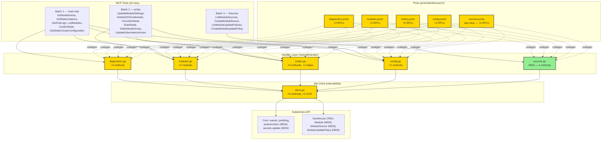

# P2 — Advanced Management: Design

**Статус:** Draft
**Дата:** 2026-05-13
**Входные артефакты:** `explore.md`, `requirements.md`

---

## 2.1 Обзор

Расширение `deckhouse-mcp` шестнадцатью новыми MCP handler'ами, разнесёнными по 6 группам требований и 3 батчам реализации:

- **Batch 1 — Read-only (6):** `GetNodeEvents`, `GetStaticInstance`, `GetPodLogs`, `ListModules`, `CordonNode`, `GetStaticClusterConfiguration`.
- **Batch 2 — Writes (6):** `UpdateModuleSettings`, `DeleteSSHCredentials`, `UncordonNode`, `DrainNode` (composite), `DeleteNodeGroup`, `UpdateKubernetesVersion`.
- **Batch 3 — Sources domain (4):** `ListModuleSources`, `CreateModuleSource`, `ListModuleUpdatePolicies`, `CreateModuleUpdatePolicy`.

Сопутствующая инфраструктура:

- **+9 методов** в `k8s.Client` (один из них — `EvictPod` через Eviction API).
- **+2 GVR** для нового домена Sources (`ModuleSourceGVR`, `ModuleUpdatePolicyGVR`) и **+1 GVR** для CRD `Module` (Block B).
- **Новый файл** `internal/handler/sources.go` + `sources_test.go`.
- **Расширение RBAC** в `deploy/rbac.yaml` (8 новых ресурсов/глаголов).
- **Расширение** integration-тестов: новые CRD-определения в `tests/integration/crds.yaml`.

Существующие P0+P1 handler'ы, их proto-определения и unit-тесты **не модифицируются по поведению**. Допустимо обновление `mockClient` (добавление function-field) и сигнатур интерфейса `k8s.Client` (добавление методов; существующие сигнатуры неизменны).

---

## 2.2 Архитектура



### Implementation Order

Реализация строго **последовательная по батчам** (как зафиксировано в `requirements.md` § Топологический порядок):

1. **Batch 1 (read-only)** первым — нет зависимостей, риск минимальный, все 6 k8s.Client методов уже существуют.
2. **Batch 2 (writes)** — добавляет 4 новых k8s.Client метода (`EvictPod`, `UncordonNode`, `DeleteSSHCredentials`, `DeleteNodeGroup`, `UpdateSecret`). Внутри батча: REQ-3.1 (CordonNode уже сделан в Batch 1) → REQ-3.2 (UncordonNode) → REQ-3.4 (DrainNode) → остальные.
3. **Batch 3 (Sources)** — добавляет 5 новых k8s.Client методов и новый файл `sources.go`. Полностью изолирован.

Сквозные требования REQ-6.* (k8s.Client расширяется до handler'а, обновление mock, RBAC, GVR, зелёные тесты/lint/generate) применяются **внутри каждого батча**.

---

## 2.3 Components and Interfaces

### Files Requiring Changes

| File | Change Type | Description |
|------|-------------|-------------|
| `proto/deckhouse/v1/diagnostics.proto` | `[MODIFIED]` | +3 RPC: `GetNodeEvents`, `GetStaticInstance`, `GetPodLogs` + соответствующие request/response messages |
| `proto/deckhouse/v1/modules.proto` | `[MODIFIED]` | +2 RPC: `ListModules`, `UpdateModuleSettings` |
| `proto/deckhouse/v1/nodes.proto` | `[MODIFIED]` | +5 RPC: `CordonNode`, `UncordonNode`, `DrainNode`, `DeleteSSHCredentials`, `DeleteNodeGroup` |
| `proto/deckhouse/v1/config.proto` | `[MODIFIED]` | +2 RPC: `GetStaticClusterConfiguration`, `UpdateKubernetesVersion` |
| `proto/deckhouse/v1/sources.proto` | `[MODIFIED]` | Был пустой stub. +4 RPC: `ListModuleSources`, `CreateModuleSource`, `ListModuleUpdatePolicies`, `CreateModuleUpdatePolicy` + service `SourcesAPI` |
| `internal/k8s/client.go` | `[MODIFIED]` | +9 методов в `Client` interface и реализации. +3 GVR-константы (`ModuleGVR`, `ModuleSourceGVR`, `ModuleUpdatePolicyGVR`). См. §2.5 |
| `internal/handler/diagnostics.go` | `[MODIFIED]` | +3 метода: `GetNodeEvents`, `GetStaticInstance`, `GetPodLogs` |
| `internal/handler/modules.go` | `[MODIFIED]` | +2 метода: `ListModules`, `UpdateModuleSettings` (deep-merge с использованием `evanphx/json-patch.v4`) |
| `internal/handler/nodes.go` | `[MODIFIED]` | +5 методов: `CordonNode`, `UncordonNode`, `DrainNode` (composite, polling 30s), `DeleteSSHCredentials`, `DeleteNodeGroup`. +1 приватный helper `evictPodsWithPDB`. +2 константы (`drainTimeoutSeconds = 300`, переиспользование `pollInterval`) |
| `internal/handler/config.go` | `[MODIFIED]` | +2 метода: `GetStaticClusterConfiguration` (новый ключ в существующем секрете), `UpdateKubernetesVersion` (read-modify-write YAML через `sigs.k8s.io/yaml`) |
| `internal/handler/sources.go` | `[NEW]` | Новый handler `SourcesHandler` с конструктором `NewSourcesHandler(client k8s.Client) *SourcesHandler` и 4 методами |
| `internal/handler/mock_client_test.go` | `[MODIFIED]` | +9 function-field в `mockClient` (по одному на каждый новый k8s.Client метод). Дефолт-значения возвращают nil/zero |
| `internal/handler/diagnostics_test.go` | `[MODIFIED]` | +6–9 тестов на новые методы (happy + not-found) |
| `internal/handler/modules_test.go` | `[MODIFIED]` | +5–7 тестов: ListModules, UpdateModuleSettings (merge cases, empty-validation, not-found) |
| `internal/handler/nodes_test.go` | `[MODIFIED]` | +12–15 тестов: cordon/uncordon (idempotency, previousState), drain (success, PDB-block, timeout, partial), deletes (happy + not-found) |
| `internal/handler/config_test.go` | `[MODIFIED]` | +4–6 тестов: GetStaticClusterConfiguration, UpdateKubernetesVersion (happy + secret missing + key missing) |
| `internal/handler/sources_test.go` | `[NEW]` | 8–10 тестов: list+create для двух CRD, already-exists, propagation на ошибки клиента |
| `cmd/deckhouse-mcp/main.go` | `[MODIFIED]` | +1 строка регистрации: `pb.RegisterSourcesAPITools(server, sourcesHandler)` (раньше service был пустой) |
| `deploy/rbac.yaml` | `[MODIFIED]` | +8 правил (см. таблицу в §2.7 explore.md): `pods/eviction:create`, `secrets:update`, `sshcredentials:delete`, `nodegroups:delete`, `modules:get,list`, `modulesources:get,list,create`, `moduleupdatepolicies:get,list,create` |
| `tests/integration/crds.yaml` | `[MODIFIED]` | +3 CRD-определения: `Module`, `ModuleSource`, `ModuleUpdatePolicy` |
| `Taskfile.yml` | `[MODIFIED]` (если необходимо) | Без изменений ожидается. Команды `task generate`/`test`/`lint` остаются прежними |

### Files NOT Requiring Changes

| File | Reason Unchanged |
|------|-----------------|
| `cmd/deckhouse-mcp/main.go` (server bootstrap, SSE handler, signal handling) | Регистрация новых сервисов аддитивна; общая структура bootstrap не меняется. Из изменений — только +1 строка `RegisterSourcesAPITools` |
| `internal/handler/releases.go` | Block C полностью покрыт в P1. P2 не вносит изменений в releases |
| `internal/handler/releases_test.go` | Соответствующий тест-файл; см. выше |
| `proto/deckhouse/v1/releases.proto` | Без изменений по той же причине |
| `internal/handler/errors_test.go` | Тестирует общую обработку ошибок; новые handler'ы используют те же шаблоны (`fmt.Errorf("op: %w", err)`) |
| Существующие методы `k8s.Client` (P0+P1) | Сигнатуры не меняются. `CordonNode(ctx, name) error` остаётся как есть — для получения `previousState` handler делает `GetNode()` отдельно (см. ADR-1) |
| Приватный helper `nodes.go:drainNode` (используется в `RemoveNode`) | НЕ модифицируется. Новый MCP tool `DrainNode` использует **отдельный** helper `evictPodsWithPDB` через Eviction API, чтобы не повлиять на существующее поведение `RemoveNode`. См. ADR-4 |
| Все тесты P0+P1 (70 unit-тестов) | Семантически не затронуты. Возможно добавление function-field в `mockClient` потребует тривиальных правок инициализации в существующих тестах (zero-value по умолчанию допустим) |
| `Dockerfile`, `.golangci.yml`, `easyp.yaml` | Без изменений — инфраструктура CI/build стабильна |

### Interface signatures (новые методы)

#### `k8s.Client` (добавляется в существующий interface в `internal/k8s/client.go`)

```go
// Core resources (typed) — additions for P2.
UncordonNode(ctx context.Context, name string) error
EvictPod(ctx context.Context, namespace, name string) error // Eviction API (PDB-aware).
UpdateSecret(ctx context.Context, secret *corev1.Secret) (*corev1.Secret, error)

// Deckhouse CRDs (dynamic/unstructured) — additions for P2.
ListModules(ctx context.Context) ([]unstructured.Unstructured, error)
DeleteSSHCredentials(ctx context.Context, name string) error
DeleteNodeGroup(ctx context.Context, name string) error
ListModuleSources(ctx context.Context) ([]unstructured.Unstructured, error)
CreateModuleSource(ctx context.Context, obj *unstructured.Unstructured) (*unstructured.Unstructured, error)
ListModuleUpdatePolicies(ctx context.Context) ([]unstructured.Unstructured, error)
CreateModuleUpdatePolicy(ctx context.Context, obj *unstructured.Unstructured) (*unstructured.Unstructured, error)
```

**Preconditions / postconditions:**

- `UncordonNode`: `name` непустой; устанавливает `Spec.Unschedulable = false`. Идемпотентен — повторный вызов на uncordoned ноде успешен.
- `EvictPod`: использует `policy/v1` `Eviction` API; respects PodDisruptionBudget. При блокировке PDB возвращает `apierrors.IsTooManyRequests` — handler различает этот класс ошибок и повторяет.
- `UpdateSecret`: optimistic concurrency через `ResourceVersion`. На конфликт версии — handler перечитает и повторит.
- `ListModules` / `ListModuleSources` / `ListModuleUpdatePolicies`: возвращают пустой slice (не nil) при отсутствии ресурсов.
- `Create*`: на существующий ресурс возвращают ошибку, обёрнутую `apierrors.IsAlreadyExists` — handler возвращает `already exists`.
- `Delete*`: на отсутствующий ресурс возвращают `apierrors.IsNotFound` — handler возвращает `not found`.

#### Handler signatures (по одному примеру на блок; полный набор соответствует proto RPC)

```go
// Diagnostics (Block A, batch 1)
func (h *DiagnosticsHandler) GetNodeEvents(
    ctx context.Context, req *pb.GetNodeEventsRequest,
) (*pb.GetNodeEventsResponse, error)

// Modules (Block B, batches 1+2)
func (h *ModulesHandler) UpdateModuleSettings(
    ctx context.Context, req *pb.UpdateModuleSettingsRequest,
) (*pb.UpdateModuleSettingsResponse, error)

// Nodes (Block D, batches 1+2)
func (h *NodesHandler) CordonNode(
    ctx context.Context, req *pb.CordonNodeRequest,
) (*pb.CordonNodeResponse, error)
func (h *NodesHandler) DrainNode(
    ctx context.Context, req *pb.DrainNodeRequest,
) (*pb.DrainNodeResponse, error)

// Config (Block E, batches 1+2)
func (h *ConfigHandler) UpdateKubernetesVersion(
    ctx context.Context, req *pb.UpdateKubernetesVersionRequest,
) (*pb.UpdateKubernetesVersionResponse, error)

// Sources (Block F, batch 3) — NEW handler
type SourcesHandler struct{ client k8s.Client }
func NewSourcesHandler(client k8s.Client) *SourcesHandler
func (h *SourcesHandler) ListModuleSources(
    ctx context.Context, req *pb.ListModuleSourcesRequest,
) (*pb.ListModuleSourcesResponse, error)
// ... (3 остальных)
```

---

## 2.4 Key Decisions (ADR)

### ADR-1: Cordon-логика на уровне `k8s.Client` + `previousState` через `GetNode`

- **Context:** REQ-3.1/REQ-3.2 требуют возвращать предыдущее состояние `Spec.Unschedulable` ноды и сохранять идемпотентность. Существующий метод `k8s.Client.CordonNode(ctx, name) error` не возвращает previousState. Добавлять второй возвращаемый параметр — breaking change для существующего helper'а `drainNode` в `nodes.go` и для всех тестов, которые мокают `CordonNodeFunc func(...) error`.
- **Options considered:**
  1. Сменить сигнатуру `CordonNode` на `(bool, error)` → ломает существующий код и моки.
  2. Добавить новый метод `CordonNodeWithPreviousState(...) (bool, error)` параллельно существующему → дублирование, два пути для одного действия.
  3. Handler-уровень делает `GetNode()` перед вызовом `CordonNode()`, читает `Spec.Unschedulable`, возвращает его как previousState. `k8s.Client.CordonNode` остаётся неизменным.
- **Decision:** Вариант 3.
- **Rationale:** Не ломает существующие сигнатуры и моки. Использует уже имеющийся `GetNode`. Стоимость — два API-вызова вместо одного (read + write), но это приемлемо для cordon-операции (низкая частота). Аналогично для `UncordonNode`, но там добавляется новый k8s.Client метод, потому что обратной операции не существует.
- **Consequences:** В мок-тестах `CordonNode`/`UncordonNode` потребуется задавать `GetNodeFunc` помимо `CordonNodeFunc`/`UncordonNodeFunc`. Race-условие между read и write существует в теории (нода может быть cordoned параллельно), но безопасно — повторное cordon идемпотентно, previousState остаётся точным с момента read'а.

### ADR-2: `UpdateModuleSettings` — Deep merge (RFC 7396 / JSON Merge Patch)

- **Context:** REQ-2.2 требует «обновить `spec.settings`, сохранив все поля, не указанные в запросе». `spec.settings` — произвольный nested объект (`map[string]any`). Возможны 3 семантики merge: shallow (top-level keys replace), deep (recursive merge), full replace.
- **Options considered:**
  1. **Shallow merge** — простой, но если `settings.foo` — объект, то replace его целиком: пользователь должен передавать ВСЁ дерево `foo`. Это нарушает REQ-2.2 на nested-уровне.
  2. **Deep merge (RFC 7396)** — рекурсивный merge; вложенные объекты сливаются; `null = remove`. Стандарт JSON.
  3. **Replace** — нарушает REQ-2.2 явно.
- **Decision:** Вариант 2 — RFC 7396 (JSON Merge Patch).
- **Rationale:** Корректное поведение на любой глубине. Стандарт K8s (`kubectl patch --type=merge`). Библиотека `gopkg.in/evanphx/json-patch.v4` уже в indirect-зависимостях через client-go — не добавляем новые deps. `null = remove` даёт способ удалять отдельные настройки точечно, без перезаписи всего объекта.
- **Consequences:** Реализация: `existingSettings := mc.Object.spec.settings`; `merged := json.Merge(existingSettings, requestSettings)`; `mc.Object.spec.settings = merged`; `UpdateModuleConfig`. Семантика `null = remove` должна быть явно задокументирована в proto-комментариях `UpdateModuleSettings.settings`.

### ADR-3: `DrainNode` — Eviction API + polling 30s

- **Context:** REQ-3.4–3.6 требуют: выселять non-DaemonSet/non-mirror поды через Eviction API (graceful, PDB-aware), таймаут 300s, при блокировке PDB — повторять, при истечении timeout — возвращать частичный результат.
- **Options considered:**
  1. **Direct delete (`DeletePod`)** — быстро, но обходит PDB и graceful shutdown. Так делает существующий приватный `drainNode` для `RemoveNode`.
  2. **Eviction API + polling 30s** — повторяющиеся попытки `EvictPod` для всех целевых подов, между раундами — пауза `pollInterval = 30s`. Аналогично паттерну `AddWorkerNode`/`pollStaticInstance`.
  3. **Eviction API + exponential backoff** — отзывчивее на старте, но новый паттерн в проекте.
- **Decision:** Вариант 2.
- **Rationale:** Соответствует REQ-3.4 (Eviction API), REQ-3.5 (повторы при PDB), REQ-3.6 (timeout). Использует существующий паттерн polling 30s — нулевая когнитивная нагрузка для следующего разработчика. Eviction API сам имеет небольшую задержку — exponential backoff не даёт значимого выигрыша.
- **Consequences:** Новый метод `k8s.Client.EvictPod` через `policy/v1` `EvictionPolicy`. Новый приватный helper `evictPodsWithPDB(ctx, nodeName, deadline)` в `nodes.go`. RBAC: `pods/eviction:create`. Тесты: 30s интервал в polling-тестах удлинит test-suite (как уже у `AddWorkerNode`-тестов ~30s).

### ADR-4: Сосуществование двух drain-путей

- **Context:** Существует приватный helper `nodes.go:drainNode` (использует `DeletePod`) для `RemoveNode` (P0). REQ-3.4 для нового MCP tool `DrainNode` требует Eviction API. Прямая замена приватного helper'а изменит поведение `RemoveNode` — это нарушит REQ-2 «не модифицируем P0+P1» и потенциально сломает 11 nodes-тестов.
- **Options considered:**
  1. Заменить приватный `drainNode` на Eviction API — ломает поведение `RemoveNode` и тесты P0/P1.
  2. Оставить приватный `drainNode` как есть, добавить **новый** приватный helper `evictPodsWithPDB(ctx, nodeName, deadline) (evicted, failed []string, timedOut bool)` для нового MCP tool `DrainNode`.
  3. Refactor `RemoveNode` для использования нового helper'а — то же что (1), но осознанный refactor.
- **Decision:** Вариант 2.
- **Rationale:** Минимальные риски, нулевое влияние на P0+P1. Дублирование кода — компромисс ради изоляции изменений. В будущем (отдельный refactor feature) `RemoveNode` можно мигрировать на новый helper.
- **Consequences:** Два пути drain коротковременно. Документировано в комментариях обеих функций. Технический долг отслеживается в `ROADMAP.md` (опционально, не в scope этого feature).

### ADR-5: `UpdateKubernetesVersion` — `sigs.k8s.io/yaml` + read-modify-write с retry на ResourceVersion conflict

- **Context:** REQ-4.3 требует прочитать Secret `d8-cluster-configuration`, изменить поле `kubernetesVersion` в YAML-ключе `cluster-configuration.yaml`, записать обратно. Без серверной валидации (доверяем reconciler'у).
- **Options considered:**
  1. **`gopkg.in/yaml.v3`** — общеупотребительный YAML парсер; не сохраняет ключи в исходном порядке.
  2. **`sigs.k8s.io/yaml`** — обёртка над JSON-парсером, гарантированно совместима с тем, как сам Kubernetes/Deckhouse читает YAML. Уже в indirect deps. Предсказуемая семантика.
  3. **Strategic merge patch через API** — Secrets не поддерживают strategic merge для ключей `data`.
- **Decision:** Вариант 2.
- **Rationale:** Совместимость с Deckhouse reconciler'ом. Уже в зависимостях. Нет рисков необычной сериализации.
- **Consequences:** Реализация: `GetSecret` → decode `data["cluster-configuration.yaml"]` через `sigs.k8s.io/yaml.Unmarshal` в `map[string]any` → assign `m["kubernetesVersion"] = req.Version` → `yaml.Marshal` → `secret.Data["cluster-configuration.yaml"] = newBytes` → `UpdateSecret`. На `apierrors.IsConflict` (ResourceVersion mismatch) — повторить read-modify-write до 3 раз.

### ADR-6: Versioning & Backward Compatibility (proto + MCP tool API)

- **Context:** P2 добавляет 16 новых RPC к существующим proto services + расширяет `k8s.Client` interface. MCP tools — это публичный контракт для AI-агентов через SSE.
- **Versioning strategy:** Все новые RPC — **строго аддитивные**. Никакие существующие RPC, request/response message, proto-поля или enum значения не модифицируются и не удаляются. Сервис `SourcesAPI` был зарегистрирован как пустой stub в P0 — добавление в него RPC обратносовместимо.
- **Breaking change assessment:** Без изменений.
  - Существующие AI-агенты, использующие P0/P1 tools, продолжают работать.
  - Старая версия сервера, не знающая новых RPC, не повлияет на новые AI-агенты — они получат ожидаемую ошибку «tool not found», и могут degradate gracefully.
  - Изменение сигнатуры `k8s.Client` интерфейса — внутренняя деталь, не выходит за границы модуля `internal/`.
- **Migration path:** Не требуется. Catалог инструментов AI-агента обновится автоматически при reconnect к новой версии сервера (MCP `tools/list` отдаст полный набор).
- **Consequences:** Lint `easyp lint` должен проходить без `breaking` warnings. CHANGELOG.md обновляется с разделом «P2 — Advanced Management» в стиле существующих P0/P1 записей.

### ADR-7: Один design.md / multi-batch task-plan

- **Context:** P2 содержит 16 handler'ов и распадается на 3 батча. Возможны два подхода: (a) один feature `p2-advanced-management` со всеми 16 в одном дизайне, или (b) три отдельных feature `p2-batch-1`, `p2-batch-2`, `p2-batch-3` с независимыми пайплайнами.
- **Options considered:**
  1. Один feature, один design, **один** task-plan с тремя секциями (по батчу).
  2. Один feature, один design, **три** task-plan'а (через серии approve в фазе 4) — нестандартно для пайплайна.
  3. Три отдельных feature.
- **Decision:** Вариант 1.
- **Rationale:** Целостный дизайн позволяет одновременно увидеть все архитектурные решения и cross-batch инварианты (например, единая стратегия RBAC, общие GVR-константы). Task-plan разбивается на секции `## Batch 1`, `## Batch 2`, `## Batch 3` внутри одного артефакта; задачи `T-N` нумеруются глобально, но группируются по батчам. Implementation проходит по T-N последовательно.
- **Consequences:** Задач `T-N` будет ~50–60 (на каждый handler: RED-test, GREEN-impl, RBAC, mock-update, integration-CRD при необходимости). Implementation-фаза будет длинной, но Review проходит один раз в конце по всему feature.

---

## 2.5 Data Models

### Новые GVR-константы (`internal/k8s/client.go`)

```go
// [NEW]
ModuleGVR = schema.GroupVersionResource{
    Group:    "deckhouse.io",
    Version:  "v1alpha1",
    Resource: "modules",
}

// [NEW]
ModuleSourceGVR = schema.GroupVersionResource{
    Group:    "deckhouse.io",
    Version:  "v1alpha1",
    Resource: "modulesources",
}

// [NEW]
ModuleUpdatePolicyGVR = schema.GroupVersionResource{
    Group:    "deckhouse.io",
    Version:  "v1alpha1",
    Resource: "moduleupdatepolicies",
}
```

### Новые константы в `internal/handler/nodes.go`

```go
// [NEW] Default DrainNode timeout in seconds (REQ-3.5).
const drainTimeoutSeconds = 300
// pollInterval (30s) — переиспользуется существующая константа.
```

### Расширение mockClient (`internal/handler/mock_client_test.go`) — добавляются 9 function-fields

```go
// [MODIFIED] mockClient — добавляются:
UncordonNodeFunc            func(ctx context.Context, name string) error
EvictPodFunc                func(ctx context.Context, namespace, name string) error
UpdateSecretFunc            func(ctx context.Context, secret *corev1.Secret) (*corev1.Secret, error)
ListModulesFunc             func(ctx context.Context) ([]unstructured.Unstructured, error)
DeleteSSHCredentialsFunc    func(ctx context.Context, name string) error
DeleteNodeGroupFunc         func(ctx context.Context, name string) error
ListModuleSourcesFunc       func(ctx context.Context) ([]unstructured.Unstructured, error)
CreateModuleSourceFunc      func(ctx context.Context, obj *unstructured.Unstructured) (*unstructured.Unstructured, error)
ListModuleUpdatePoliciesFunc   func(ctx context.Context) ([]unstructured.Unstructured, error)
CreateModuleUpdatePolicyFunc   func(ctx context.Context, obj *unstructured.Unstructured) (*unstructured.Unstructured, error)
```

> Дефолтное поведение (когда поле = nil) — возврат `nil, nil` или `nil` (для error-only методов). Существующие тесты не сломаются.

### Proto messages (репрезентативные новые types)

Полный список — в proto-файлах после `easyp generate`. Ниже — типичные представители.

```proto
// [NEW] Block A
message GetNodeEventsRequest { string name = 1; }
message GetNodeEventsResponse { repeated NodeEvent events = 1; }
message NodeEvent {
  string type           = 1;  // Normal | Warning
  string reason         = 2;
  string message        = 3;
  string source         = 4;
  google.protobuf.Timestamp last_timestamp = 5;
  int32  count          = 6;
}

message GetStaticInstanceRequest { string name = 1; }
message GetStaticInstanceResponse {
  string                 name             = 1;
  string                 address          = 2;
  string                 phase            = 3;
  string                 credentials_ref  = 4;
  optional string        node_name        = 5;
  map<string, string>    labels           = 6;
}

message GetPodLogsRequest {
  string          namespace = 1;
  string          pod       = 2;
  optional string container = 3;
  optional int64  tail      = 4;
  optional string since     = 5;  // duration: "30m", "1h"
}
message GetPodLogsResponse { string logs = 1; }

// [NEW] Block B
message ListModulesResponse { repeated Module modules = 1; }
message Module {
  string name   = 1;
  int32  weight = 2;
  string source = 3;
  string state  = 4;  // Enabled | Disabled
}
message UpdateModuleSettingsRequest {
  string                  name     = 1;
  google.protobuf.Struct  settings = 2;  // RFC 7396 merge; null = remove
}
message UpdateModuleSettingsResponse { string name = 1; }

// [NEW] Block D
message CordonNodeRequest  { string name = 1; }
message CordonNodeResponse { bool previous_state = 1; }   // true if node was already cordoned
message UncordonNodeRequest  { string name = 1; }
message UncordonNodeResponse { bool previous_state = 1; }

message DrainNodeRequest {
  string         name             = 1;
  optional int32 timeout_seconds  = 2;  // default = 300
}
message DrainNodeResponse {
  bool             cordoned       = 1;
  int32            evicted_count  = 2;
  repeated string  failed_pods    = 3;
  bool             timed_out      = 4;
  string           elapsed        = 5;  // e.g. "42s"
}

message DeleteSSHCredentialsRequest  { string name = 1; }
message DeleteSSHCredentialsResponse { bool success = 1; }
message DeleteNodeGroupRequest       { string name = 1; }
message DeleteNodeGroupResponse      { bool success = 1; }

// [NEW] Block E
message GetStaticClusterConfigurationResponse { string configuration = 1; }
message UpdateKubernetesVersionRequest        { string version = 1; }
message UpdateKubernetesVersionResponse       { bool updated = 1; string previous_version = 2; }

// [NEW] Block F
message ListModuleSourcesResponse { repeated ModuleSource sources = 1; }
message ModuleSource {
  string  name      = 1;
  string  registry  = 2;
  string  status    = 3;
}
message CreateModuleSourceRequest {
  string  name     = 1;
  string  registry = 2;
}
message CreateModuleSourceResponse { string name = 1; }

message ListModuleUpdatePoliciesResponse { repeated ModuleUpdatePolicy policies = 1; }
message ModuleUpdatePolicy {
  string  name        = 1;
  string  update_mode = 2;  // Auto | Manual
}
message CreateModuleUpdatePolicyRequest {
  string  name        = 1;
  string  update_mode = 2;
}
message CreateModuleUpdatePolicyResponse { string name = 1; }
```

> Финальные имена и опциональность полей могут быть скорректированы после `easyp lint` в фазе Implementation. Семантика и обязательные поля фиксированы выше.

---

## 2.6 Correctness Properties

> Каждое требование REQ-X.Y покрыто ≥ 1 свойством. Свойства abbreviated при ссылках в таблицах: `CP-N`.

```
Property 1: GetNodeEvents возвращает события только для запрошенной ноды
Category:   Propagation
Statement:  For all (cluster state S, node name N), `GetNodeEvents(N)` returns
            exactly the subset of events from S where event.involvedObject.name == N,
            ordered by event.lastTimestamp ascending.
Validates:  Requirements 1.1
```

```
Property 2: not-found ошибки симметричны для read-операций
Category:   Equivalence
Statement:  For all (resource type R ∈ {Node, StaticInstance, Pod, ModuleConfig,
            SSHCredentials, NodeGroup, Secret-key}), if the resource does not
            exist, the corresponding handler returns an error wrapping the K8s
            "not found" condition (apierrors.IsNotFound) with the message
            containing the requested name.
Validates:  Requirements 1.2, 1.4, 1.6, 2.3, 3.3, 3.8, 3.10, 4.2, 4.4
```

```
Property 3: GetStaticInstance возвращает все обязательные поля
Category:   Propagation
Statement:  For all StaticInstance resources si in the cluster,
            `GetStaticInstance(si.metadata.name)` returns a response where
            name = si.metadata.name, address = si.spec.address,
            phase = si.status.currentStatus.phase (or empty),
            credentials_ref = si.spec.credentialsRef.name,
            node_name reflects si.status.nodeRef (if present).
Validates:  Requirements 1.3
```

```
Property 4: GetPodLogs передаёт container/tail/since опции в k8s
Category:   Propagation
Statement:  For all (namespace ns, pod p, optional container c, tail t, since s),
            `GetPodLogs(ns, p, c, t, s)` invokes k8s.Client.GetPodLogs with the
            same arguments unchanged, and returns the resulting log content
            verbatim.
Validates:  Requirements 1.5
```

```
Property 5: ListModules не теряет полей CRD
Category:   Propagation
Statement:  For all Module resources m in the cluster, the entry corresponding
            to m in `ListModules` response carries name = m.metadata.name,
            weight = m.spec.weight (or 0), source = m.spec.source (or empty),
            state = m.status.state (or empty).
Validates:  Requirements 2.1
```

```
Property 6: UpdateModuleSettings — deep merge сохраняет неизменённые поля
Category:   Propagation
Statement:  For all (existing settings E, request settings R), after
            `UpdateModuleSettings(name, R)` succeeds, the resulting
            ModuleConfig.spec.settings = JSONMergePatch(E, R), where
            JSONMergePatch follows RFC 7396 (recursive object merge,
            null removes a key, non-object values replace).
Validates:  Requirements 2.2
```

```
Property 7: UpdateModuleSettings отвергает пустой settings
Category:   Absence
Statement:  For all requests R with R.settings = {} (empty map), the system
            returns a validation error and does NOT call UpdateModuleConfig.
Validates:  Requirements 2.4
```

```
Property 8: CordonNode идемпотентность + previousState
Category:   Equivalence
Statement:  For all (node N, current Spec.Unschedulable = U), `CordonNode(N)`
            returns previous_state = U; after the call Spec.Unschedulable = true;
            calling `CordonNode(N)` twice in a row is equivalent to calling once
            (final state is identical).
Validates:  Requirements 3.1
```

```
Property 9: UncordonNode идемпотентность + previousState
Category:   Equivalence
Statement:  For all (node N, current Spec.Unschedulable = U), `UncordonNode(N)`
            returns previous_state = U; after the call Spec.Unschedulable = false;
            calling `UncordonNode(N)` twice in a row is equivalent to calling once.
Validates:  Requirements 3.2
```

```
Property 10: DrainNode исключает DaemonSet и mirror pods
Category:   Exclusion
Statement:  For all pods p on node N, after `DrainNode(N)` completes (success or
            timeout), no pod with OwnerReferences containing kind="DaemonSet"
            or annotation "kubernetes.io/config.mirror" was the target of an
            EvictPod call.
Validates:  Requirements 3.4
```

```
Property 11: DrainNode выполняет cordon как первый шаг
Category:   Propagation
Statement:  For all calls `DrainNode(N)`, k8s.Client.CordonNode is invoked
            before any k8s.Client.EvictPod for pods on node N. If CordonNode
            fails, no eviction is attempted.
Validates:  Requirements 3.4 (cordon-as-step-1 design constraint)
```

```
Property 12: DrainNode уважает PDB через retry
Category:   Propagation
Statement:  For all pods p where EvictPod returns IsTooManyRequests (PDB block),
            DrainNode retries the eviction at the next polling round; total
            elapsed time before the pod is reported as failed_pods does not
            exceed timeout_seconds.
Validates:  Requirements 3.5
```

```
Property 13: DrainNode timeout даёт частичный результат
Category:   Absence
Statement:  For all (node N, timeout T) where eviction does not complete within T,
            `DrainNode` returns timed_out = true with failed_pods listing all
            pods that were not evicted; never panics, never returns a fatal
            error in this scenario.
Validates:  Requirements 3.6
```

```
Property 14: Delete-операции необратимы и идемпотентны на отсутствующем ресурсе
Category:   Equivalence
Statement:  For all resource type R ∈ {SSHCredentials, NodeGroup}, if the
            resource does not exist, `Delete*(name)` returns a not-found error
            (Property 2). If it does exist, the resource is removed and a
            second call returns not-found.
Validates:  Requirements 3.7, 3.8, 3.9, 3.10
```

```
Property 15: GetStaticClusterConfiguration читает правильный ключ
Category:   Propagation
Statement:  For all Secret d8-cluster-configuration in kube-system,
            `GetStaticClusterConfiguration` returns the value of
            data["static-cluster-configuration.yaml"] verbatim as a string;
            absence of the key returns an error containing "static-cluster-
            configuration.yaml".
Validates:  Requirements 4.1, 4.2
```

```
Property 16: UpdateKubernetesVersion round-trip YAML
Category:   Round-trip
Statement:  For all (existing cluster-configuration.yaml content C parsed as
            map M, target version V), after `UpdateKubernetesVersion(V)`
            succeeds, parsing the updated value yields a map M' where
            M'["kubernetesVersion"] = V and for all keys k != kubernetesVersion,
            M'[k] = M[k].
Validates:  Requirements 4.3
```

```
Property 17: ListModuleSources / ListModuleUpdatePolicies возвращают пустой
            slice при отсутствии ресурсов
Category:   Equivalence
Statement:  For all empty cluster states (no ModuleSource / ModuleUpdatePolicy
            resources), the corresponding List* handler returns a response with
            an empty (non-nil) slice and nil error.
Validates:  Requirements 5.1, 5.4
```

```
Property 18: Create-операции отвергают дубликаты
Category:   Exclusion
Statement:  For all resource type R ∈ {ModuleSource, ModuleUpdatePolicy} and
            name N, if a resource of type R with name N already exists,
            `CreateR(N, ...)` returns an error wrapping
            apierrors.IsAlreadyExists; no second resource is created.
Validates:  Requirements 5.3, 5.6
```

```
Property 19: CreateModuleSource / CreateModuleUpdatePolicy успешный путь
Category:   Propagation
Statement:  For all valid request R with name N, `CreateR(N, ...)` constructs
            an Unstructured object with apiVersion "deckhouse.io/v1alpha1",
            correct kind, metadata.name = N, and spec carrying request fields;
            calls k8s.Client.CreateR exactly once.
Validates:  Requirements 5.2, 5.5
```

```
Property 20: k8s.Client интерфейс расширяется до handler-метода (process invariant)
Category:   Propagation
Statement:  For all new handler methods in the implementation diff, the
            corresponding k8s.Client interface methods exist in
            internal/k8s/client.go and have non-empty implementations on the
            client struct. (Verified by `go build`.)
Validates:  Requirements 6.1
```

```
Property 21: mockClient синхронизирован с k8s.Client интерфейсом
Category:   Propagation
Statement:  For all methods M in k8s.Client interface, mockClient has a
            corresponding function-field MFunc such that mockClient implements
            k8s.Client. (Verified by compile-time check + a smoke test
            `var _ k8s.Client = (*mockClient)(nil)`.)
Validates:  Requirements 6.2
```

```
Property 22: RBAC покрывает все используемые operations
Category:   Propagation
Statement:  For all (resource R, verb V) used by any new handler at runtime,
            deploy/rbac.yaml contains a matching rule. (Verified by manual
            audit + integration-test that exercises all handlers in a real
            cluster against the deployed RBAC.)
Validates:  Requirements 6.3
```

```
Property 23: Новые CRD имеют GVR-константы
Category:   Propagation
Statement:  For all new CRDs introduced by the feature (Module, ModuleSource,
            ModuleUpdatePolicy), a corresponding `*GVR` exported variable
            exists in internal/k8s/client.go and is used by all dynamic-client
            calls for that CRD (no inline schema.GroupVersionResource literals).
Validates:  Requirements 6.4
```

```
Property 24: P0+P1 регрессия отсутствует
Category:   Absence
Statement:  After the implementation diff lands, `task test`, `task generate`,
            and `task lint` all complete with exit code 0; the count of
            existing passing tests does not decrease.
Validates:  Requirements 6.5, 6.6
```

### Coverage Matrix (Requirement → CP)

| Requirement | Properties |
|-------------|-----------|
| REQ-1.1 | CP-1 |
| REQ-1.2 | CP-2 |
| REQ-1.3 | CP-3 |
| REQ-1.4 | CP-2 |
| REQ-1.5 | CP-4 |
| REQ-1.6 | CP-2 |
| REQ-2.1 | CP-5 |
| REQ-2.2 | CP-6 |
| REQ-2.3 | CP-2 |
| REQ-2.4 | CP-7 |
| REQ-3.1 | CP-8 |
| REQ-3.2 | CP-9 |
| REQ-3.3 | CP-2 |
| REQ-3.4 | CP-10, CP-11 |
| REQ-3.5 | CP-12 |
| REQ-3.6 | CP-13 |
| REQ-3.7 | CP-14 |
| REQ-3.8 | CP-2, CP-14 |
| REQ-3.9 | CP-14 |
| REQ-3.10 | CP-2, CP-14 |
| REQ-4.1 | CP-15 |
| REQ-4.2 | CP-2, CP-15 |
| REQ-4.3 | CP-16 |
| REQ-4.4 | CP-2 |
| REQ-5.1 | CP-17 |
| REQ-5.2 | CP-19 |
| REQ-5.3 | CP-18 |
| REQ-5.4 | CP-17 |
| REQ-5.5 | CP-19 |
| REQ-5.6 | CP-18 |
| REQ-6.1 | CP-20 |
| REQ-6.2 | CP-21 |
| REQ-6.3 | CP-22 |
| REQ-6.4 | CP-23 |
| REQ-6.5 | CP-24 |
| REQ-6.6 | CP-24 |

Все 32 требования покрыты ≥ 1 CP.

---

## 2.7 Error Handling

| Scenario | Detection | Action |
|----------|-----------|--------|
| Запрашиваемый ресурс не существует (Node, StaticInstance, Pod, ModuleConfig, SSHCredentials, NodeGroup, Secret) | `apierrors.IsNotFound(err)` после k8s API вызова | Wrap: `fmt.Errorf("resource %q not found: %w", name, err)`. Возврат через MCP как tool error. |
| Создаваемый ресурс уже существует (ModuleSource, ModuleUpdatePolicy, SSHCredentials, StaticInstance, NodeGroup) | `apierrors.IsAlreadyExists(err)` | Wrap: `fmt.Errorf("resource %q already exists: %w", name, err)`. Не повторять create. |
| `UpdateModuleSettings` с пустым `settings` (`len(req.Settings) == 0`) | Pre-call validation в handler | Возврат `errEmptyModuleSettings` без обращения к API. |
| `GetPodLogs` с невалидным `since` duration | `time.ParseDuration` ошибка в k8s.Client | Wrap, возврат до открытия log stream. |
| `UpdateKubernetesVersion`: ключ `cluster-configuration.yaml` отсутствует в Secret | `_, ok := secret.Data[key]; !ok` | `fmt.Errorf("key cluster-configuration.yaml not found in secret")`. |
| `UpdateKubernetesVersion`: невалидный YAML в Secret | `yaml.Unmarshal` ошибка | Wrap, не модифицируем секрет. |
| `UpdateKubernetesVersion`: ResourceVersion conflict | `apierrors.IsConflict(err)` после `UpdateSecret` | Retry (до 3 раз): `GetSecret` → modify → `UpdateSecret`. После 3 неудач — возврат ошибки conflict. |
| `DrainNode`: PDB блокирует eviction | `apierrors.IsTooManyRequests(err)` от `EvictPod` | Откладываем pod до следующего polling-раунда. Не падаем. |
| `DrainNode`: timeout истёк | `time.Now().After(deadline)` в polling-цикле | Возврат response с `timed_out = true`, `failed_pods` со списком невыселенных. Не возвращаем ошибку (REQ-3.6). |
| `DrainNode`: cordon шаг fail | `CordonNode` возвращает err | Возврат ошибки. Eviction не начинаем. |
| `DrainNode`: ошибка `EvictPod` ≠ TooManyRequests/NotFound | Любая другая api-error | Pod добавляется в `failed_pods`, polling продолжается до timeout. (Альтернатива — возврат ошибки сразу — отвергнута: один проблемный pod не должен блокировать остальные.) |
| `DrainNode`: `EvictPod` возвращает NotFound | Pod уже исчез (был evicted ранее или был удалён) | Игнорируем pod (считаем выселенным). |
| `EvictPod` API недоступен (older K8s без `policy/v1` Eviction) | `apierrors.IsMethodNotSupported` | Возврат ошибки до начала drain. (Все поддерживаемые Deckhouse кластеры имеют `policy/v1`, поэтому fallback на `DeletePod` не делаем.) |
| Cordon/UncordonNode race: после `GetNode` нода удалена | `apierrors.IsNotFound` от `CordonNode`/`UncordonNode` | Возврат not-found ошибки. |
| Любая операция: context deadline / cancel | `errors.Is(err, context.Canceled)` или `context.DeadlineExceeded` | Wrap и возврат. Polling-циклы (`DrainNode`) проверяют `ctx.Done()` явно перед `time.After(pollInterval)`. |
| RBAC permission denied | `apierrors.IsForbidden(err)` | Wrap с указанием отсутствующего permission. Не retry. |

---

## 2.8 Testing Strategy

### Test Style Source

**Test Style Source:** Tier 2 — adjacent test files
- Reference files: `internal/handler/diagnostics_test.go`, `modules_test.go`, `nodes_test.go`, `releases_test.go`, `mock_client_test.go`, `errors_test.go`.
- Key patterns to follow:
  - Standard Go `testing` package, no external test framework.
  - Function-field mocks via `mockClient` struct in `mock_client_test.go`.
  - Table-driven tests с `t.Run(name, func(t *testing.T) {...})`.
  - Fixtures как `*unstructured.Unstructured` literals; `corev1.Node`/`Pod`/`Event` literals для typed.
  - `errors.Is`, `strings.Contains` для проверки error-сообщений.
  - Polling-тесты (`AddWorkerNode`) принимают реальный 30s sleep — это допускается; testing с инжектируемым clock не используется.
- **PBT unavailable** — using targeted unit tests as substitute (см. таблицу Property-Based Tests ниже).

### Project Commands

| Action   | Command            |
|----------|--------------------|
| Test     | `task test`        |
| Build    | `task build`       |
| Lint     | `task lint`        |
| Generate | `task generate`    |

### Unit Tests

> Тесты сгруппированы по handler-файлу; имена в стиле `TestXxx_Scenario`. Каждый тест помечен тегом `Feature/<name>`.

| Test | Description | Tags |
|------|-------------|------|
| `TestGetNodeEvents_Happy` | Возвращает события только для запрошенной ноды, отсортированные по времени | `Feature/GetNodeEvents` |
| `TestGetNodeEvents_NoEvents` | Возвращает пустой slice, когда у ноды нет событий | `Feature/GetNodeEvents` |
| `TestGetNodeEvents_NotFound` | Не найденная нода → not-found error от k8s.Client пробрасывается | `Feature/GetNodeEvents` |
| `TestGetStaticInstance_Happy` | Все обязательные поля spec/status извлечены | `Feature/GetStaticInstance` |
| `TestGetStaticInstance_NotFound` | not-found из k8s.Client → ошибка handler'а | `Feature/GetStaticInstance` |
| `TestGetPodLogs_Happy` | Опции container/tail/since передаются в k8s.Client | `Feature/GetPodLogs` |
| `TestGetPodLogs_NotFound` | Под/namespace не найден → ошибка | `Feature/GetPodLogs` |
| `TestListModules_Happy` | name/weight/source/state корректно вытащены из CRD | `Feature/ListModules` |
| `TestListModules_Empty` | Пустой кластер → empty slice (не nil) | `Feature/ListModules` |
| `TestUpdateModuleSettings_Happy` | Deep merge с nested keys; неизменённые поля сохраняются | `Feature/UpdateModuleSettings` |
| `TestUpdateModuleSettings_NullRemoves` | `null` в request удаляет поле из settings (RFC 7396) | `Feature/UpdateModuleSettings` |
| `TestUpdateModuleSettings_Empty` | Пустой settings → validation error без вызова Update | `Feature/UpdateModuleSettings` |
| `TestUpdateModuleSettings_NotFound` | ModuleConfig не существует → not-found | `Feature/UpdateModuleSettings` |
| `TestCordonNode_Happy` | previousState = false; после вызова Spec.Unschedulable=true | `Feature/CordonNode` |
| `TestCordonNode_AlreadyCordoned` | previousState = true; идемпотентность | `Feature/CordonNode` |
| `TestCordonNode_NotFound` | not-found от GetNode | `Feature/CordonNode` |
| `TestUncordonNode_Happy` | previousState = true; после вызова Spec.Unschedulable=false | `Feature/UncordonNode` |
| `TestUncordonNode_AlreadyUncordoned` | previousState = false; идемпотентность | `Feature/UncordonNode` |
| `TestUncordonNode_NotFound` | not-found | `Feature/UncordonNode` |
| `TestDrainNode_Happy` | Cordon → Evict всех non-DS pods → ответ с evicted_count, не timed_out | `Feature/DrainNode` |
| `TestDrainNode_SkipsDaemonSet` | DaemonSet pods не выселяются | `Feature/DrainNode` |
| `TestDrainNode_SkipsMirror` | Mirror pods не выселяются | `Feature/DrainNode` |
| `TestDrainNode_PDBBlocksThenSucceeds` | TooManyRequests на первом раунде → retry → успех | `Feature/DrainNode` |
| `TestDrainNode_Timeout` | Pod продолжает блокироваться → timed_out=true, failed_pods непустой | `Feature/DrainNode` |
| `TestDrainNode_CordonFails` | CordonNode error → eviction не запускается | `Feature/DrainNode` |
| `TestDrainNode_PodAlreadyGone` | EvictPod NotFound → pod считается выселенным | `Feature/DrainNode` |
| `TestDeleteSSHCredentials_Happy` | success=true | `Feature/DeleteSSHCredentials` |
| `TestDeleteSSHCredentials_NotFound` | not-found | `Feature/DeleteSSHCredentials` |
| `TestDeleteNodeGroup_Happy` | success=true | `Feature/DeleteNodeGroup` |
| `TestDeleteNodeGroup_NotFound` | not-found | `Feature/DeleteNodeGroup` |
| `TestGetStaticClusterConfiguration_Happy` | Возвращает содержимое ключа `static-cluster-configuration.yaml` | `Feature/GetStaticClusterConfiguration` |
| `TestGetStaticClusterConfiguration_KeyMissing` | Ключ отсутствует в секрете → ошибка | `Feature/GetStaticClusterConfiguration` |
| `TestGetStaticClusterConfiguration_SecretMissing` | Secret отсутствует → not-found | `Feature/GetStaticClusterConfiguration` |
| `TestUpdateKubernetesVersion_Happy` | YAML обновлён, остальные поля сохранены | `Feature/UpdateKubernetesVersion` |
| `TestUpdateKubernetesVersion_SecretMissing` | not-found | `Feature/UpdateKubernetesVersion` |
| `TestUpdateKubernetesVersion_KeyMissing` | Ошибка с описанием | `Feature/UpdateKubernetesVersion` |
| `TestUpdateKubernetesVersion_RetryOnConflict` | IsConflict на первом Update → retry → успех | `Feature/UpdateKubernetesVersion` |
| `TestListModuleSources_Empty` | Пустой кластер → empty slice | `Feature/ListModuleSources` |
| `TestListModuleSources_Happy` | name/registry/status корректно вытащены | `Feature/ListModuleSources` |
| `TestCreateModuleSource_Happy` | Корректный Unstructured отправлен | `Feature/CreateModuleSource` |
| `TestCreateModuleSource_AlreadyExists` | already-exists ошибка | `Feature/CreateModuleSource` |
| `TestListModuleUpdatePolicies_Empty` | Empty slice | `Feature/ListModuleUpdatePolicies` |
| `TestListModuleUpdatePolicies_Happy` | name/update_mode корректно вытащены | `Feature/ListModuleUpdatePolicies` |
| `TestCreateModuleUpdatePolicy_Happy` | Корректный Unstructured отправлен | `Feature/CreateModuleUpdatePolicy` |
| `TestCreateModuleUpdatePolicy_AlreadyExists` | already-exists ошибка | `Feature/CreateModuleUpdatePolicy` |
| `TestMockClient_ImplementsInterface` | Compile-time assertion `var _ k8s.Client = (*mockClient)(nil)` | `Feature/Infrastructure` |

### Property-Based Tests (substitute via targeted unit tests)

> PBT-библиотека отсутствует. Каждое CP покрыто целевым unit-тестом с явными представительными входами вместо случайной генерации.

| Test | Property | Generator description (пред-определённые входы) | Tags |
|------|----------|--------------------------------------------------|------|
| `propGetNodeEventsScopedToNode` | CP-1 | 3 события с involvedObject.name ∈ {N1, N2, N3}; вызов GetNodeEvents(N2) возвращает только событие 2 | `Property/1` |
| `propNotFoundSymmetric` | CP-2 | Таблица из 9 ресурс-типов × {happy, missing}; для missing — каждый handler возвращает not-found | `Property/2` |
| `propGetStaticInstanceFieldsExtracted` | CP-3 | 2 SI: с полным status и без status — все поля извлечены корректно | `Property/3` |
| `propGetPodLogsOptionsPropagated` | CP-4 | 4 комбинации (container±, tail±, since±) — все опции достигают k8s.Client | `Property/4` |
| `propListModulesFieldsExtracted` | CP-5 | 3 Module с разными комбинациями полей spec/status | `Property/5` |
| `propUpdateModuleSettingsDeepMerge` | CP-6 | 5 кейсов: replace top-level, merge nested object, replace primitive in nested, add new key, no-op (R = E) | `Property/6` |
| `propUpdateModuleSettingsRejectsEmpty` | CP-7 | settings = {} → error; UpdateModuleConfig не вызван | `Property/7` |
| `propCordonNodeIdempotent` | CP-8 | Таблица: U_before ∈ {true, false}, повтор cordon — финальное состояние не меняется | `Property/8` |
| `propUncordonNodeIdempotent` | CP-9 | Таблица: U_before ∈ {true, false}, повтор uncordon | `Property/9` |
| `propDrainNodeExcludesDSAndMirror` | CP-10 | Pod-список содержит: 1 regular + 1 DS-owned + 1 mirror — только regular получает EvictPod | `Property/10` |
| `propDrainNodeCordonFirst` | CP-11 | Mock с counter; CordonNode вызван до первого EvictPod; на CordonNode-fail EvictPod не вызывается | `Property/11` |
| `propDrainNodeRespectsPDB` | CP-12 | Mock EvictPod возвращает TooManyRequests на 1-м round, success на 2-м — final evicted_count = N | `Property/12` |
| `propDrainNodeTimeoutPartial` | CP-13 | Mock EvictPod всегда возвращает TooManyRequests; timeout=2s — timed_out=true, failed_pods непустой, нет panic | `Property/13` |
| `propDeleteIdempotentOnAbsent` | CP-14 | Для каждого resource type ∈ {SSHCredentials, NodeGroup}: первый delete — happy; повторный — not-found | `Property/14` |
| `propGetStaticClusterConfigKey` | CP-15 | Secret с обоими ключами → корректный ключ возвращён; Secret без ключа → ошибка | `Property/15` |
| `propUpdateKubernetesVersionRoundTrip` | CP-16 | 3 YAML-фикстуры: minimal, full, deeply-nested → после Update kubernetesVersion=V, остальные ключи равны | `Property/16` |
| `propListSourcesEmpty` | CP-17 | Mock возвращает empty list для обоих CRD → handler возвращает empty slice (не nil) | `Property/17` |
| `propCreateRejectsDuplicate` | CP-18 | Mock возвращает IsAlreadyExists для обоих CRD → handler возвращает already-exists ошибку | `Property/18` |
| `propCreateConstructsCorrectObject` | CP-19 | Capture аргумент в mock; проверка apiVersion, kind, metadata.name, spec | `Property/19` |
| `propClientInterfaceComplete` | CP-20 | Compile-time: handler-методы используют только методы из k8s.Client | `Property/20` |
| `propMockImplementsClient` | CP-21 | Compile-time: `var _ k8s.Client = (*mockClient)(nil)` | `Property/21` |
| `propRBACAuditDocumented` | CP-22 | Не unit-тест: manual checklist в review-фазе + integration-test в Kind | `Property/22` |
| `propGVRConstantsExist` | CP-23 | Compile-time references на ModuleGVR, ModuleSourceGVR, ModuleUpdatePolicyGVR | `Property/23` |
| `propNoP0P1Regression` | CP-24 | `task test && task lint && task generate` exit 0; integration test зелёный | `Property/24` |

---

## Notes for Task Plan phase

- Implementation phase разбивается на 3 секции (по батчу). Внутри батча — для каждого handler: `T-N RED-test` → `T-N+1 GREEN-impl` → `T-N+2 mock-update + RBAC + GVR (если нужно)` → `T-N+3 generate + lint + test`.
- Композитный handler `DrainNode` — самый объёмный TDD-цикл (≥ 7 unit-тестов = ≥ 7 RED+GREEN пар).
- Перед merge каждого батча — `task generate && task lint && task test`. После merge всех 3 батчей — `task integration` в Kind.
