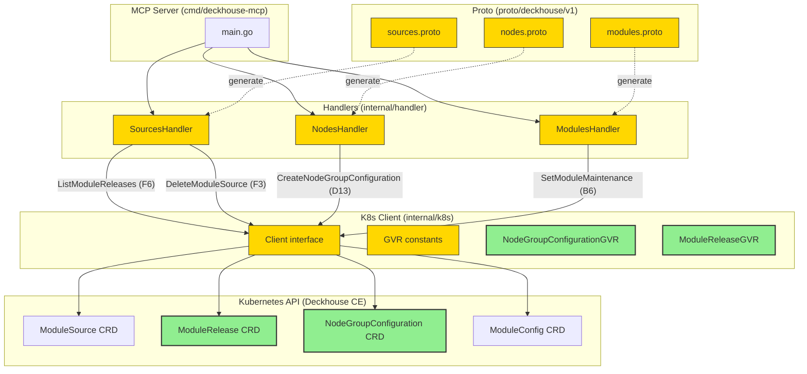

# P3 — Edge Cases — Design

**Status:** Draft
**Phase:** [3/6] design
**Date:** 2026-05-15

## 2.1 Overview

P3 завершает roadmap MCP Server для Deckhouse Kubernetes Platform, добавляя 4 нишевых handler'а к существующим 39:

1. **F6 `ListModuleReleases`** (read) — список версий модуля с обязательным фильтром `module_name` и опциональным `phase`
2. **F3 `DeleteModuleSource`** (write) — удаление с safe-by-default + `force` flag
3. **D13 `CreateNodeGroupConfiguration`** (write) — создание bash-скриптов bootstrap нод
4. **B6 `SetModuleMaintenance`** (write) — pause/resume reconciliation модуля без disable

Все 4 ортогональны и реализуются single-batch (Option A из exploration). Sequence: **F6 → F3 → D13 → B6** (F3 зависит от F6 для force-check; B6 в конце из-за спайка).

## 2.2 Architecture



**Implementation order:**

1. **k8s.Client extension first** (REQ-5.1): добавляем 4 новых метода + 2 GVR константы. Обновляем `mockClient` (REQ-5.2).
2. **Proto extensions** (RPCs + messages): F6 → F3 → D13 → B6. После каждого — `task generate`.
3. **Handler implementations**: F6 → F3 → D13 → spike → B6.
4. **RBAC update** (`deploy/rbac.yaml`, REQ-5.3).
5. **Maintenance mode spike**: 5-min `kubectl explain moduleconfig.spec` (выполняется перед B6).
6. **Integration verification**: `task integration` → tools/list = 43.
7. **Docs update**: `ROADMAP.md` (REQ-5.7), `CHANGELOG.md` (REQ-5.8).

## 2.3 Components and Interfaces

### Files Requiring Changes

| File | Change Type | Description |
|------|-------------|-------------|
| `proto/deckhouse/v1/sources.proto` | `[MODIFIED]` | +RPCs `ListModuleReleases`, `DeleteModuleSource`; +messages `ListModuleReleasesRequest/Response`, `ModuleReleaseInfo`, `DeleteModuleSourceRequest/Response` |
| `proto/deckhouse/v1/nodes.proto` | `[MODIFIED]` | +RPC `CreateNodeGroupConfiguration`; +messages `CreateNodeGroupConfigurationRequest/Response` |
| `proto/deckhouse/v1/modules.proto` | `[MODIFIED]` | +RPC `SetModuleMaintenance`; +messages `SetModuleMaintenanceRequest/Response` |
| `proto/deckhouse/v1/sources.{pb,mcp}.go` | `[MODIFIED]` | Generated by `task generate` |
| `proto/deckhouse/v1/nodes.{pb,mcp}.go` | `[MODIFIED]` | Generated by `task generate` |
| `proto/deckhouse/v1/modules.{pb,mcp}.go` | `[MODIFIED]` | Generated by `task generate` |
| `internal/k8s/client.go` | `[MODIFIED]` | +`NodeGroupConfigurationGVR`, `ModuleReleaseGVR`; +4 методa в `Client` interface (см. Data Models §2.5); +их impl на typed/dynamic client |
| `internal/handler/sources.go` | `[MODIFIED]` | +`ListModuleReleases`, `DeleteModuleSource` методы на `SourcesHandler` |
| `internal/handler/nodes.go` | `[MODIFIED]` | +`CreateNodeGroupConfiguration` метод на `NodesHandler` |
| `internal/handler/modules.go` | `[MODIFIED]` | +`SetModuleMaintenance` метод на `ModulesHandler` |
| `internal/handler/sources_test.go` | `[MODIFIED]` | +тесты F6, F3 |
| `internal/handler/nodes_test.go` | `[MODIFIED]` | +тесты D13 |
| `internal/handler/modules_test.go` | `[MODIFIED]` | +тесты B6 |
| `internal/handler/mock_client_test.go` | `[MODIFIED]` | +4 function-fields для новых методов |
| `deploy/rbac.yaml` | `[MODIFIED]` | +permissions: `nodegroupconfigurations` (create), `modulereleases` (get, list), `modulesources` (delete), `moduleconfigs` (patch — переиспользуется из P2) |
| `tests/integration/crds.yaml` | `[MODIFIED]` | +CRDs `nodegroupconfigurations.deckhouse.io`, `modulereleases.deckhouse.io` |
| `CHANGELOG.md` | `[MODIFIED]` | +секция «[Unreleased] — P3 — Edge Cases» (REQ-5.8) |
| `ROADMAP.md` | `[MODIFIED]` | mark P3 as ✅ Done (4/4) (REQ-5.7) |

### Files NOT Requiring Changes

| File | Reason Unchanged |
|------|-----------------|
| `cmd/deckhouse-mcp/main.go` | Регистрация tools происходит автоматически через `pb.Register{Service}Tools(server, handler)` — все три handler'а (`SourcesHandler`, `NodesHandler`, `ModulesHandler`) уже зарегистрированы в P0/P1/P2 |
| `proto/deckhouse/v1/diagnostics.proto`, `releases.proto`, `config.proto` | P3 не затрагивает Diagnostics, Releases или Configuration блоки |
| `internal/handler/diagnostics.go`, `config.go`, `releases.go` | Те же блоки не задействованы |
| `Dockerfile`, `Taskfile.yml`, `easyp.yaml` | Build/lint/codegen pipeline не меняется |
| `deploy/deployment.yaml`, `service.yaml` | Deployment manifest, ServiceAccount, Service остаются как в P0 |
| `tests/integration/setup.sh`, `teardown.sh`, `test.sh` | Integration scripts работают на уровне tools/list count + smoke tests; P2 smoke-тесты deferred (не P3 scope) |

### Interface Signatures

**`k8s.Client` extensions** (added in `internal/k8s/client.go`):

```go
// ListModuleReleases returns all ModuleRelease resources matching the label
// selector "module=<moduleName>". Empty moduleName returns an error.
ListModuleReleases(ctx context.Context, moduleName string) ([]unstructured.Unstructured, error)

// DeleteModuleSource deletes a ModuleSource resource by name. Returns
// kerrors.IsNotFound-compatible error if not found.
DeleteModuleSource(ctx context.Context, name string) error

// CreateNodeGroupConfiguration creates a new NodeGroupConfiguration. Returns
// kerrors.IsAlreadyExists-compatible error if a resource with the same name exists.
CreateNodeGroupConfiguration(ctx context.Context, obj *unstructured.Unstructured) (*unstructured.Unstructured, error)

// PatchModuleConfigMaintenance applies a JSON merge patch to spec.maintenance
// (or equivalent field per task-plan spike). Returns kerrors.IsNotFound-compatible
// error if ModuleConfig not found.
PatchModuleConfigMaintenance(ctx context.Context, name string, enabled bool) (*unstructured.Unstructured, error)
```

**Handler signatures** (generated from proto, implementation goes in `internal/handler/*.go`):

```go
// SourcesHandler — extends existing P2 implementation
func (h *SourcesHandler) ListModuleReleases(
    ctx context.Context, req *pb.ListModuleReleasesRequest,
) (*pb.ListModuleReleasesResponse, error)

func (h *SourcesHandler) DeleteModuleSource(
    ctx context.Context, req *pb.DeleteModuleSourceRequest,
) (*pb.DeleteModuleSourceResponse, error)

// NodesHandler — extends existing P0/P1/P2 implementation
func (h *NodesHandler) CreateNodeGroupConfiguration(
    ctx context.Context, req *pb.CreateNodeGroupConfigurationRequest,
) (*pb.CreateNodeGroupConfigurationResponse, error)

// ModulesHandler — extends existing P0/P1/P2 implementation
func (h *ModulesHandler) SetModuleMaintenance(
    ctx context.Context, req *pb.SetModuleMaintenanceRequest,
) (*pb.SetModuleMaintenanceResponse, error)
```

## 2.4 Key Decisions (ADRs)

### ADR-1: F3 DeleteModuleSource — safe-by-default with force flag

- **Context:** Удаление `ModuleSource` может оставить orphan `ModuleRelease` записи или сломать модули зависящие от source. Нужно решить — delegate к Deckhouse cascade-cleanup или предупреждать AI agent
- **Options considered:**
  1. Hard delete без проверок (доверяем Deckhouse owner refs)
  2. Pre-check + hard block (возвращать ошибку при наличии releases)
  3. Pre-check + force flag override (safe-by-default + explicit override)
- **Decision:** Option 3 — pre-check через `ListModuleReleases` с `force=false` default; `force=true` пропускает проверку
- **Rationale:** AI agent получает информативный feedback (количество и примеры зависимых releases) без блокирования законных destructive операций. Паттерн `kubectl --cascade=orphan` хорошо знаком ecosystem
- **Consequences:**
  - +1 LIST query per delete (~50ms latency, негативно)
  - Лишний параметр `force` в proto (negligibly)
  - Защита от случайного удаления (positively)

### ADR-2: F6 ListModuleReleases — REQUIRED module_name filter

- **Context:** `ModuleRelease` CRD может содержать сотни записей (50 модулей × 5-20 версий). Без фильтра один `list` запрос вернёт мегабайты JSON и истощит LLM context window
- **Options considered:**
  1. Optional `module_name` (default возвращает всё)
  2. REQUIRED `module_name` (нет default, ошибка валидации без него)
  3. Pagination через cursor / page-size
- **Decision:** Option 2 — REQUIRED `module_name`
- **Rationale:** P3 — это edge case tool; типичные сценарии всегда имеют конкретный module в контексте. Pagination overkill для P3 (~20 записей max per module). REQUIRED заставляет AI agent явно указывать модуль, что также улучшает observability
- **Consequences:**
  - Невозможно сделать "глобальный" список всех releases — но это не нужно типично
  - Если в будущем понадобится — добавим `ListAllModuleReleases` или сделаем `module_name` optional в v2

### ADR-3: B6 SetModuleMaintenance — abstract `enabled` boolean over Kubernetes field name

- **Context:** Точное имя поля maintenance mode в `ModuleConfig.spec` (`maintenance` / `suspended` / `paused`) не подтверждено и требует спайка
- **Options considered:**
  1. Использовать `string maintenance_value` в proto (e.g., `"NoOperations"`, `""`)
  2. Использовать `bool enabled` (handler сам выбирает Kubernetes поле и значение)
  3. Заблокировать proto до спайка
- **Decision:** Option 2 — `bool enabled` в proto; имя Kubernetes поля прячется в Go-логике handler'а
- **Rationale:** Proto API стабилен независимо от внутренней реализации Deckhouse. Если поле переименуется или семантика изменится — мы фиксим только Go-код, без breaking change для AI agent. Также — boolean более понятен LLM'у чем enum/string значение
- **Consequences:**
  - Нужна одна точка изменения в Go (constant + JSON path) если spec изменится
  - Tool description должна явно описывать observed behavior («pauses reconciliation») а не Kubernetes field name

### ADR-4: D13 CreateNodeGroupConfiguration — default weight = 100

- **Context:** Поле `spec.weight` определяет порядок выполнения скриптов на ноде. Если AI agent не передаст — нужно sensible default
- **Options considered:**
  1. REQUIRED weight (заставить agent выбрать)
  2. Default 0 (lowest priority)
  3. Default 100 (середина диапазона 1-200)
- **Decision:** Option 3 — default 100
- **Rationale:** Соответствует Deckhouse practice (sample manifests используют weight в районе 50-150). 0 — невалидное значение в Deckhouse реализации; REQUIRED создаёт friction для типичного use-case (один скрипт без приоритета). 100 = «обычный» порядок
- **Consequences:**
  - AI agent может непреднамеренно создать конфликтующие weights — но это maintenance issue не security
  - Default ясно описан в tool description

### ADR-5: B6 reconciliation pause semantics — full pause (not selective)

- **Context:** Maintenance mode может означать pause только enable/disable transitions или full reconciliation pause (см. exploration §Open Questions item 1)
- **Options considered:**
  1. Document как "selective pause" (только spec changes)
  2. Document как "full reconciliation pause" (всё замораживается)
- **Decision:** Option 2 — full reconciliation pause
- **Rationale:** Стандарт ecosystem (ArgoCD `syncPolicy=manual`, Flux `suspend: true`); более понятная семантика для AI agent debugging workflows; точное Deckhouse поведение подтверждается спайком
- **Consequences:**
  - Tool description совпадает с industry-standard pattern
  - Если Deckhouse реализует selective pause — handler возвращает корректное `previousState`, но description нужно будет уточнить (post-merge minor doc update)

> **Note:** Этот feature не меняет existing public APIs (только добавляет новые RPCs). Breaking change ADR не требуется.

## 2.5 Data Models

### Proto messages [NEW]

```protobuf
// === Block 1: F6 ListModuleReleases ===

// [NEW] Request to list module releases filtered by module name and optional phase.
message ListModuleReleasesRequest {
  string module_name = 1;          // REQUIRED — фильтр labels["module"]=<value>
  optional string phase = 2;        // optional — фильтр status.phase
}

// [NEW] Compact projection of ModuleRelease CRD.
message ModuleReleaseInfo {
  string name = 1;        // metadata.name (e.g., "deckhouse-1.70.0")
  string module = 2;      // labels["module"] — FK to Module
  string version = 3;     // spec.version
  string source = 4;      // labels["source"] — FK to ModuleSource
  string phase = 5;       // status.phase: Pending|Deployed|Superseded|Suspended
  string approved = 6;    // spec.approved: "true"|"false"|""
}

// [NEW] Response containing the filtered list.
message ListModuleReleasesResponse {
  repeated ModuleReleaseInfo releases = 1;
}

// === Block 2: F3 DeleteModuleSource ===

// [NEW] Request to delete a ModuleSource with safety check.
message DeleteModuleSourceRequest {
  string name = 1;             // REQUIRED
  optional bool force = 2;      // default false — skip pre-check
}

// [NEW] Response — success and informational message.
message DeleteModuleSourceResponse {
  bool success = 1;
  string message = 2;          // human-readable description
}

// === Block 3: D13 CreateNodeGroupConfiguration ===

// [NEW] Request to create a NodeGroupConfiguration.
message CreateNodeGroupConfigurationRequest {
  string name = 1;                       // REQUIRED — metadata.name
  string content = 2;                    // REQUIRED — bash script body
  repeated string node_groups = 3;        // REQUIRED — список target NodeGroups (non-empty)
  optional int32 weight = 4;              // default 100 — execution priority (1-200)
}

// [NEW] Response — created resource info.
message CreateNodeGroupConfigurationResponse {
  bool success = 1;
  string name = 2;
}

// === Block 4: B6 SetModuleMaintenance ===

// [NEW] Request to enter or exit maintenance mode.
message SetModuleMaintenanceRequest {
  string module_name = 1;       // REQUIRED — ModuleConfig name
  bool enabled = 2;              // true = enter maintenance, false = exit
}

// [NEW] Response with previous state for idempotency.
message SetModuleMaintenanceResponse {
  bool success = 1;
  string previous_state = 2;    // "enabled"|"disabled"
}
```

### Go interface extensions

```go
// internal/k8s/client.go — additions to Client interface
type Client interface {
    // ... existing 35 methods from P0/P1/P2 ...

    // [NEW] P3 additions:
    ListModuleReleases(ctx context.Context, moduleName string) ([]unstructured.Unstructured, error)
    DeleteModuleSource(ctx context.Context, name string) error
    CreateNodeGroupConfiguration(ctx context.Context, obj *unstructured.Unstructured) (*unstructured.Unstructured, error)
    PatchModuleConfigMaintenance(ctx context.Context, name string, enabled bool) (*unstructured.Unstructured, error)
}

// [NEW] GVR constants in internal/k8s/client.go
var (
    NodeGroupConfigurationGVR = schema.GroupVersionResource{
        Group:    "deckhouse.io",
        Version:  "v1alpha1",
        Resource: "nodegroupconfigurations",
    }
    ModuleReleaseGVR = schema.GroupVersionResource{
        Group:    "deckhouse.io",
        Version:  "v1alpha1",
        Resource: "modulereleases",
    }
)
```

## 2.6 Correctness Properties

```
Property 1: ListModuleReleases фильтрует по module label
Category: Equivalence
Statement: For all module_name M and ModuleRelease set S, the result equals { r ∈ S | r.labels["module"] == M }
Validates: Requirements 1.1

Property 2: ListModuleReleases с phase фильтром применяет AND logic
Category: Equivalence
Statement: For all (M, P) and S, result == { r ∈ S | r.labels["module"] == M ∧ r.status.phase == P }
Validates: Requirements 1.2

Property 3: Empty result не вызывает ошибку
Category: Absence
Statement: For all M with no matching releases, response.releases is empty list and error is nil
Validates: Requirements 1.3

Property 4: Empty module_name отвергается до K8s API call
Category: Absence
Statement: For all calls with module_name == "", no client.ListModuleReleases is invoked, error is "module_name is required"
Validates: Requirements 1.4

Property 5: DeleteModuleSource без force блокирует при active releases
Category: Exclusion
Statement: For all (name, force=false) and active releases R≠∅, ModuleSource is NOT deleted ∧ error contains "active releases"
Validates: Requirements 2.1

Property 6: DeleteModuleSource без force успешен при empty releases
Category: Equivalence
Statement: For all (name, force=false) and R=∅, ModuleSource IS deleted ∧ response.success == true
Validates: Requirements 2.2

Property 7: DeleteModuleSource с force пропускает pre-check
Category: Equivalence
Statement: For all (name, force=true), no client.ListModuleReleases is invoked, ModuleSource is deleted directly
Validates: Requirements 2.3

Property 8: DeleteModuleSource not-found семантика
Category: Equivalence
Statement: For all (name, force=*) where ModuleSource does not exist, error matches kerrors.IsNotFound
Validates: Requirements 2.4

Property 9: CreateNodeGroupConfiguration строит correct unstructured
Category: Equivalence
Statement: For all (name, content, node_groups, weight), created object has spec.{content, nodeGroups, weight} == inputs
Validates: Requirements 3.1

Property 10: CreateNodeGroupConfiguration default weight
Category: Equivalence
Statement: For all calls без weight, created object has spec.weight == 100
Validates: Requirements 3.2

Property 11: CreateNodeGroupConfiguration already-exists
Category: Equivalence
Statement: For all (name) with existing NodeGroupConfiguration, error matches kerrors.IsAlreadyExists ∧ existing object is NOT modified
Validates: Requirements 3.3

Property 12: CreateNodeGroupConfiguration валидация
Category: Absence
Statement: For all calls with content == "" OR node_groups == [], no client call is invoked, validation error returned
Validates: Requirements 3.4

Property 13: SetModuleMaintenance enter/exit round-trip
Category: Round-trip
Statement: For all module M in state S, SetMaintenance(true) → SetMaintenance(false) returns M to state equivalent to S (ignoring intermediate metadata.resourceVersion)
Validates: Requirements 4.1, 4.2

Property 14: SetModuleMaintenance идемпотентность
Category: Equivalence
Statement: For all module M in maintenance state E, SetMaintenance(E) returns success=true ∧ previousState matches actual state ∧ no API mutation (or no-op patch)
Validates: Requirements 4.3

Property 15: SetModuleMaintenance not-found
Category: Equivalence
Statement: For all module_name M where ModuleConfig does not exist, error matches kerrors.IsNotFound
Validates: Requirements 4.4

Property 16: k8s.Client extends before handler implementation
Category: Propagation (process invariant)
Statement: For all new handler H requiring K8s operation O, the corresponding Client method exists before H references it (verified via build success)
Validates: Requirements 5.1

Property 17: mockClient синхронизирован с Client interface
Category: Propagation (compile-time invariant)
Statement: For all methods in Client interface, mockClient implements them (verified via type assertion var _ k8s.Client = (*mockClient)(nil))
Validates: Requirements 5.2

Property 18: RBAC покрывает used K8s operations
Category: Propagation
Statement: For all client methods invoked by P3 handlers, deploy/rbac.yaml contains corresponding (apiGroups, resources, verbs) tuple
Validates: Requirements 5.3

Property 19: GVR constants defined for new CRDs
Category: Equivalence
Statement: NodeGroupConfigurationGVR and ModuleReleaseGVR are defined in internal/k8s/client.go and referenced by P3 handlers
Validates: Requirements 5.4

Property 20: P0/P1/P2 регрессия отсутствует
Category: Absence
Statement: For all existing tests in internal/handler before P3, after P3 they continue to PASS (115 → ≥115)
Validates: Requirements 5.5

Property 21: Generate + Lint pipeline clean
Category: Absence
Statement: After P3 changes, task generate exits 0 ∧ task lint reports issues=0
Validates: Requirements 5.6

Property 22: ROADMAP reflects shipped state
Category: Equivalence
Statement: After P3 merge, ROADMAP.md Implementation Order table shows P3 as "✅ Done (4/4)" ∧ Phase progress tracker has [x] for P3
Validates: Requirements 5.7

Property 23: CHANGELOG documents P3
Category: Equivalence
Statement: After P3 merge, CHANGELOG.md contains "[Unreleased] — P3 — Edge Cases" section listing all 4 tools and infra changes
Validates: Requirements 5.8
```

## 2.7 Error Handling

| Scenario | Detection | Action |
|----------|-----------|--------|
| `ListModuleReleases` с пустым `module_name` | Validation в handler до K8s API call | Return error `module_name is required` (no API call) |
| `ListModuleReleases` K8s API failure | Wrap `kerrors` from dynamic client | Return wrapped error `list modulereleases: %w` |
| `DeleteModuleSource` pre-check finds active releases (force=false) | `client.ListModuleReleases(filter=source)` returns non-empty | Return error `module source 'X' has N active releases (e.g., Y, Z); pass force=true to delete anyway` |
| `DeleteModuleSource` not-found | `kerrors.IsNotFound(err)` from delete call | Return wrapped error preserving IsNotFound semantics |
| `DeleteModuleSource` other K8s error | Generic K8s API error | Wrap as `delete modulesource: %w` |
| `CreateNodeGroupConfiguration` already-exists | `kerrors.IsAlreadyExists(err)` from create call | Return wrapped error preserving IsAlreadyExists semantics |
| `CreateNodeGroupConfiguration` пустой content/node_groups | Validation в handler | Return error `content is required` или `at least one node_group is required` |
| `SetModuleMaintenance` not-found | `kerrors.IsNotFound(err)` from get/patch call | Return wrapped error preserving IsNotFound semantics |
| `SetModuleMaintenance` patch конфликт (resourceVersion) | `kerrors.IsConflict(err)` | Retry once with fresh GET + PATCH (best-effort idempotency) |
| Maintenance field name mismatch (post-spike) | Compile-time или runtime если spec изменился | Спайк в task-plan phase предотвращает; fallback — fail-fast с descriptive error |
| Generate / Lint failures | `task generate` / `task lint` non-zero exit | Block merge; fix proto / lint issues iteratively |

## 2.8 Testing Strategy

### Test Style Source

**Test Style Source:** Tier 2 (adjacent test files exist in target package)

- **Evidence:** `internal/handler/sources_test.go` (8 tests P2), `nodes_test.go` (24 tests P0+P1+P2), `modules_test.go` (10 tests P0+P1+P2), `mock_client_test.go` (35+ function-fields)
- **Key patterns to follow:**
  - Test naming: `Test{Handler}_{Method}_{Scenario}` (e.g., `TestSourcesHandler_ListModuleReleases_Success`)
  - Mock `k8s.Client` через function-fields в `mock_client_test.go` (no external mock library)
  - Table-driven tests где есть несколько scenarios одного метода
  - Assertions через `t.Errorf` + `reflect.DeepEqual` или structural comparison
  - PBT unavailable for Go без gopter/quick — using targeted unit tests as substitute (pattern as in P0/P1/P2)

### Project Commands

| Action | Command |
|--------|---------|
| Test | `task test` |
| Build | `task build` |
| Lint | `task lint` |
| Generate | `task generate` |

### Unit Tests

| Test | Description | Tags |
|------|-------------|------|
| `TestSourcesHandler_ListModuleReleases_Success` | Happy path: returns N releases for module | `Feature/F6` `Property/1` |
| `TestSourcesHandler_ListModuleReleases_PhaseFilter` | Phase filter applied as AND with module_name | `Feature/F6` `Property/2` |
| `TestSourcesHandler_ListModuleReleases_Empty` | No matching releases → empty list, no error | `Feature/F6` `Property/3` |
| `TestSourcesHandler_ListModuleReleases_EmptyModuleName` | Empty module_name → validation error, no API call | `Feature/F6` `Property/4` |
| `TestSourcesHandler_DeleteModuleSource_NoForce_Blocked` | force=false + active releases → blocked with informative error | `Feature/F3` `Property/5` |
| `TestSourcesHandler_DeleteModuleSource_NoForce_OK` | force=false + no releases → success | `Feature/F3` `Property/6` |
| `TestSourcesHandler_DeleteModuleSource_Force_Bypass` | force=true → no pre-check, direct delete | `Feature/F3` `Property/7` |
| `TestSourcesHandler_DeleteModuleSource_NotFound` | not-found error preserved | `Feature/F3` `Property/8` |
| `TestNodesHandler_CreateNodeGroupConfiguration_Success` | Builds correct unstructured with all fields | `Feature/D13` `Property/9` |
| `TestNodesHandler_CreateNodeGroupConfiguration_DefaultWeight` | weight unset → 100 in created object | `Feature/D13` `Property/10` |
| `TestNodesHandler_CreateNodeGroupConfiguration_AlreadyExists` | already-exists error preserved | `Feature/D13` `Property/11` |
| `TestNodesHandler_CreateNodeGroupConfiguration_EmptyContent` | content="" → validation error before API | `Feature/D13` `Property/12` |
| `TestNodesHandler_CreateNodeGroupConfiguration_EmptyNodeGroups` | node_groups=[] → validation error before API | `Feature/D13` `Property/12` |
| `TestModulesHandler_SetModuleMaintenance_Enter` | enabled=true patches spec.maintenance, returns prev | `Feature/B6` `Property/13` |
| `TestModulesHandler_SetModuleMaintenance_Exit` | enabled=false unsets spec.maintenance | `Feature/B6` `Property/13` |
| `TestModulesHandler_SetModuleMaintenance_Idempotent` | Calling enter when already in maintenance → success, no mutation | `Feature/B6` `Property/14` |
| `TestModulesHandler_SetModuleMaintenance_NotFound` | not-found error preserved | `Feature/B6` `Property/15` |
| `TestModulesHandler_SetModuleMaintenance_RetryOnConflict` | resourceVersion conflict → 1 retry → success | `Feature/B6` `Property/14` |

### Property-Based Tests (substitute)

PBT библиотека не используется (P0/P1/P2 pattern). Substituted with targeted unit tests above:

| Test | Property | Generator description (substitute) | Tags |
|------|----------|-------------------------------------|------|
| `TestSourcesHandler_ListModuleReleases_PhaseFilter` | CP-2 | Fixed inputs covering AND logic edge cases (M+P matches, M only, P only, neither) | `Property/2` |
| `TestSourcesHandler_DeleteModuleSource_NoForce_Blocked` | CP-5 | Fixed inputs: 1, 2, 5 active releases — verifies error message format | `Property/5` |
| `TestModulesHandler_SetModuleMaintenance_RoundTrip` | CP-13 | Fixed sequence: enter → exit → verify equivalence | `Property/13` |
| Build verification (compile success of `mock_client_test.go`) | CP-17 | Compile-time invariant — `var _ k8s.Client = (*mockClient)(nil)` ensures sync | `Property/17` |
| `task lint` and `task generate` in implementation phase | CP-21 | Pipeline-level invariant verified during VERIFY tasks | `Property/21` |
| `go test ./...` regression check | CP-20 | All existing P0/P1/P2 tests must continue to PASS | `Property/20` |

### Integration Tests (Deferred to v2)

P2 smoke-тесты в `tests/integration/test.sh` — **отложены** (deferred per exploration §Scope Boundaries). Текущая integration validation: `task integration` проверяет `tools/list = 43` (включая 4 новых tool descriptors). Полнофункциональные integration smoke-tests for P3 — отдельная техдолг фича.
